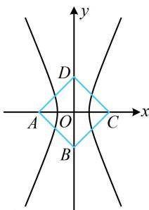
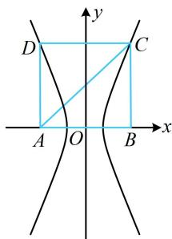

> [!faq]- 《第1节 双曲线的定义、标准方程及简单几何性质》参考答案
>
> > [!success]- **【答案】** A
>
> > [!note]- **【分析】**
> > 本题未单列分析。
>
> > [!note]- **【解析】**
> > A
> >
> > 解析：先画图看双曲线的焦点到底是正方形对角的两个顶点，还是相邻的两个顶点，若焦点是正方形对角的两个顶点，如图1，双曲线 $E$ 不可能过正方形的另外两个顶点，不合题意，若焦点是正方形相邻的两个顶点，如图2，要求实轴长 $2a$ ，可用双曲线的定义，因为正方形边长为2，所以 $\left|CA\right| - \left|CB\right| = 2a$ $= 2\sqrt{2} -2$ ，故双曲线 $E$ 的实轴长为 $2\sqrt{2} -2$ ：
> >
> >   
> > 图1
> >
> >   
> > 图2
