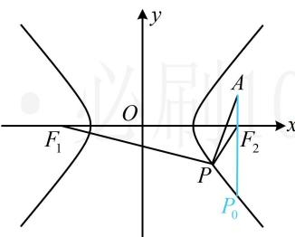

> [!faq]- 《第1节 双曲线的定义、标准方程及简单几何性质》参考答案
>
> > [!success]- **【答案】** $1 - 2 \sqrt{3}$
>
> > [!note]- **【分析】**
> > 本题未单列分析。
>
> > [!note]- **【解析】**
> > 解析：如图，直接分析 $\left|PA\right|-\left|PF_{1}\right|$ 的最大值不易，涉及 $\left|PF_{1}\right|$ ，可利用双曲线定义转化为 $\left|PF_{2}\right|$ 来看，
> > 由题意， $F_{2}(3,0)$ ， $\left|PF_{1}\right|-\left|PF_{2}\right|=2\sqrt{3}$ ，所以 $\left|PF_{1}\right|=\left|PF_{2}\right|+2\sqrt{3}$ ，故 $\left|PA\right|-\left|PF_{1}\right|=\left|PA\right|-\left|PF_{2}\right|-2\sqrt{3}$ ①，
> > 由三角形两边之差小于第三边知 $\left|PA\right|-\left|PF_{2}\right|\leq\left|AF_{2}\right|=1$ ，
> > 当且仅当 P 位于图中 $P_{0}$ 处时等号成立，
> > 结合①可得 $\left|PA\right|-\left|PF_{1}\right|\leq1-2\sqrt{3}$ 所以 $\left|PA\right|-\left|PF_{1}\right|$ 的最大值为 $1-2\sqrt{3}$ .
> >
> > 
