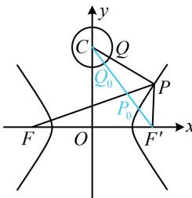

> [!faq]- 《第1节 双曲线的定义、标准方程及简单几何性质》参考答案
>
> > [!success]- **【答案】** B
>
> > [!note]- **【分析】**
> > 本题未单列分析。
>
> > [!note]- **【解析】**
> > 解析：双曲线的渐近线为 $y = \pm \sqrt{\frac{5}{m}} x$ ，由 $\sqrt{5}x + 2y = 0$ 可得 $y = -\frac{\sqrt{5}}{2} x$ ，因为 $y = -\frac{\sqrt{5}}{2}$ 是其中一条渐近线，
> > 所以 $-\sqrt{\frac{5}{m}}=-\frac{\sqrt{5}}{2}$ ，解得：m=4，再看 $\left|PQ\right|+\left|PF\right|$ 的最小定点的距离最值模型比较简单，故考虑先取定 P，
> > 如图，当 Q 在圆 C 上运动时， $|PQ|\geq|PC|-1$ 当且仅当点 Q 为线段 PC 与圆 C 交点时取等号，
> > 所以 $\left|PQ\right|+\left|PF\right|\geq\left|PC\right|-1+\left|PF\right|=\left|PC\right|+\left|PF\right|-1$ ①，
> > 再求 $\left|PC\right|+\left|PF\right|$ 的最小值，直接分析不易，涉及 $\left|PF\right|$ ，可
> >
> > 再求 $|PC| + |PF|$ 的最小值，直接分析不易，涉及 $|PF|$ ，可用双曲线定义转化到右焦点来看，
> >
> > 记双曲线的右焦点为 $F^{\prime}(3,0)$ ，则 $\left|PF\right| - \left|PF^{\prime}\right| = 4$
> >
> > 所以 $\left|PF\right|=\left|PF'\right|+4$ ，故 $\left|PC\right|+\left|PF\right|=\left|PC\right|+\left|PF'\right|+4$ ②，
> >
> > 由三角形两边之和大于第三边可得 $\left|PC\right| + \left|PF'\right| \geq \left|CF'\right|$
> >
> > $$
> > = \sqrt {\left| O C \right| ^ {2} + \left| O F ^ {\prime} \right| ^ {2}} = 5
> > $$
> >
> > 代入②得 $|PC| + |PF| \geq 9$ ，再代入①得 $|PQ| + |PF| \geq 8$ ，
> >
> > 当 $P$ ， $Q$ 分别与图中 $P_{0}$ ， $Q_{0}$ 重合时取等号，
> >
> > 
> >
> > 所以 $(|PQ| + |PF|)_{\min} = 8$
> >
> > 一数·必刷100讲
