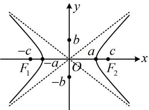
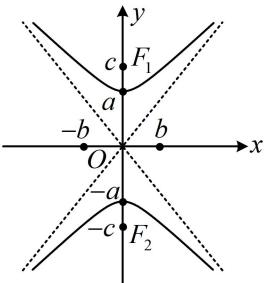
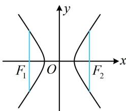

<!-- source-part:1 pages:1-6 -->

# 模块四 双曲线与方程

# 第1节 双曲线的定义、标准方程及简单几何性质（★★）

## 内容提要

1. 双曲线定义：设 $F_{1}$ ， $F_{2}$ 是平面内的两个定点，若平面内的点 $P$ 满足 $\left\| PF_1\right| - \left|PF_2\right| = 2a (0 < 2a < \left|F_1F_2\right|$ ，则点 $P$ 的轨迹是以 $F_{1}$ ， $F_{2}$ 为焦点的双曲线。

## 2. 双曲线的标准方程及简单几何性质

<table><tr><td>标准方程</td><td> $\frac{x^2}{a^2}-\frac{y^2}{b^2}=1(a>0,b>0)$ </td><td> $\frac{y^2}{a^2}-\frac{x^2}{b^2}=1(a>0,b>0)$ </td></tr><tr><td>焦点坐标</td><td>左焦点 $F_1(-c,0)$ ,右焦点 $F_2(c,0)$ </td><td>上焦点 $F_1(0,c)$ ,下焦点 $F_2(0,-c)$ </td></tr><tr><td>焦距</td><td colspan="2"> $|F_1F_2|=2c$ ,其中 $c$ 叫做半焦距,且 $c^2=a^2+b^2$ </td></tr><tr><td>图形</td><td></td><td></td></tr><tr><td>范围</td><td>x≤-a或x≥a,y∈R</td><td>y≤-a或y≥a,x∈R</td></tr><tr><td>对称性</td><td colspan="2">关于x轴、y轴、原点对称</td></tr><tr><td>实轴端点(顶点)</td><td>(±a,0)</td><td>(0,±a)</td></tr><tr><td>虚轴端点</td><td>(0,±b)</td><td>(±b,0)</td></tr><tr><td>实轴长</td><td colspan="2">2a,其中a叫做实半轴长</td></tr><tr><td>虚轴长</td><td colspan="2">2b,其中b叫做虚半轴长</td></tr><tr><td>渐近线</td><td>y=±b/a x</td><td>y=±a/b x</td></tr><tr><td>离心率</td><td colspan="2">e=c/a(e&gt;1)</td></tr></table>

3. 双曲线通径公式：过焦点且与双曲线实轴垂直的弦叫做通径，通径长为 $\frac{2b^2}{a}$ .

![[高中/总复习/教辅/一数常规版2026/第10章 解析几何/模块4 双曲线与方程/第1节 双曲线的定义、标准方程及简单几何性质/类型01_双曲线定义的运用/类型01_双曲线定义的运用.md]]
![[高中/总复习/教辅/一数常规版2026/第10章 解析几何/模块4 双曲线与方程/第1节 双曲线的定义、标准方程及简单几何性质/类型02_双曲线的标准方程及简单几何性质/类型02_双曲线的标准方程及简单几何性质.md]]
![[高中/总复习/教辅/一数常规版2026/第10章 解析几何/模块4 双曲线与方程/第1节 双曲线的定义、标准方程及简单几何性质/强化训练/强化训练.md]]
