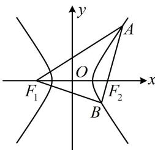

> [!faq]- 《第1节 双曲线的定义、标准方程及简单几何性质》例题解析
>
> > [!success]- **【答案】** 12
>
> > [!note]- **【分析】**
> > 本题未单列分析。
>
> > [!note]- **【解析】**
> > 解析：涉及双曲线上的点和左、右焦点，考虑双曲线的定义，
> >
> > 如图，由双曲线定义， $\left\{ \begin{array}{l} |AF_1| - |AF_2| = 4 \\ |BF_1| - |BF_2| = 4 \end{array} \right.$
> >
> > 两式相加得： $\left|AF_1\right| + \left|BF_1\right| - \left|AF_2\right| - \left|BF_2\right| = \left|AF_1\right| + \left|BF_1\right| - \left|AB\right| = 8$
> >
> > 
> >
> > 结合 $|AB|=2$ 可得 $|AF_{1}|+|BF_{1}|=8+|AB|=10$ ，
> >
> > 所以 $\triangle ABF_{1}$ 的周长 $L = |AF_{1}| + |BF_{1}| + |AB| = 10 + 2 = 12$
