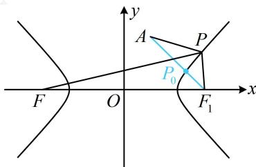

> [!faq]- 《第1节 双曲线的定义、标准方程及简单几何性质》例题解析
>
> > [!success]- **【答案】** $2 \sqrt { 2 } + 4$
>
> > [!note]- **【分析】**
> > 本题未单列分析。
>
> > [!note]- **【解析】**
> > 解析：如图，直接分析 $|PA| + |PF|$ 的最小值不易，涉及 $|PF|$ ，可考虑用定义转化到右焦点来分析，
> >
> > 设双曲线的右焦点为 $F_{1}(3,0)$ ，则 $\left|PF\right| - \left|PF_{1}\right| = 4$
> >
> > 所以 $\left|PF\right|=4+\left|PF_{1}\right|$ ，故 $\left|PA\right|+\left|PF\right|=\left|PA\right|+\left|PF_{1}\right|+4$ ①，
> >
> > 由三角形两边之和大于第三边可得 $|PA| + |PF_1| \geq |AF_1|$
> >
> > $= \sqrt{(1 - 3)^2 + (2 - 0)^2} = 2\sqrt{2}$ ，当且仅当 $P$ 与图中 $P_0$ 重合时取等号，结合①可得 $\left|PA\right| + \left|PF\right|\geq 2\sqrt{2} +4$ ，故 $(\left|PA\right| + \left|PF\right|)_{\min} = 2\sqrt{2} +4.$
> >
> > 
>
> > [!tip]- **【反思】**
> > 可以发现，双曲线定义与椭圆运用思路类似，实际上大部分题目处理思路也相同，故要类比学习.
