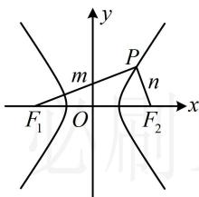

> [!faq]- 《第2节 双曲线的焦点三角形相关问题》参考答案
>
> > [!success]- **【答案】** A
>
> > [!note]- **【分析】**
> > 本题未单列分析。
>
> > [!note]- **【解析】**
> > 解析：已知离心率，可将变量 $a, b, c$ 统一起来， $e = \frac{c}{a} = \sqrt{5} \Rightarrow c = \sqrt{5} a$ ，所以 $\left|F_1F_2\right| = 2c = 2\sqrt{5} a$ ，焦点三角形中涉及垂直关系，常用勾股定理翻译，并结合定义处理，设 $\left|PF_1\right| = m$ ， $\left|PF_2\right| = n$ ，如图，因为 $F_1P \perp F_2P$ ，所以 $m^2 + n^2 = \left|F_1F_2\right|^2 = 20a^2$ ①，由双曲线定义， $|m - n| = 2a$ ②，把①配方可得 $m^2 + n^2 = (m - n)^2 + 2mn = 20a^2$ ，结合式②可得 $4a^2 + 2mn = 20a^2$ ，所以 $mn = 8a^2$ ，故 $S_{\triangle PF_1F_2} = \frac{1}{2} mn = 4a^2$ ，由题意， $S_{\triangle PF_1F_2} = 4$ ，所以 $4a^2 = 4$ ，故 $a = 1$ 。
> >
> > 
