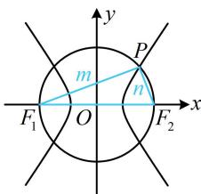

> [!faq]- 《第2节 双曲线的焦点三角形相关问题》参考答案
>
> > [!success]- **【答案】** A
>
> > [!note]- **【分析】**
> > 本题未单列分析。
>
> > [!note]- **【解析】**
> > A
> >
> > 解析：由题意，双曲线的半焦距 $c = \sqrt{t + 1 - t} = 1$
> >
> > 所给圆即为以 $F_{1}F_{2}$ 为直径的圆，点 $P$ 在圆上隐含了 $PF_{1} \perp PF_{2}$ ，可用勾股定理结合双曲线定义来处理，如图，设 $\left|PF_{1}\right| = m$ ， $\left|PF_{2}\right| = n$ ，
> >
> > 则 $m^2 + n^2 = \left|F_1F_2\right|^2 = 4c^2 = 4$ ①，
> >
> > 由双曲线定义， $|m - n| = 2\sqrt{t}$ ②，
> >
> > 由①可得 $m^2 + n^2 = (m - n)^2 + 2mn = 4$ ，将②代入得 $4t + 2mn = 4$ ，所以 $mn = 2 - 2t$ ，故 $S_{\triangle PF_1F_2} = \frac{1}{2} mn = 1 - t$ 。
> >
> > 
