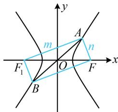

> [!faq]- 《第2节 双曲线的焦点三角形相关问题》参考答案
>
> > [!success]- **【答案】** D
>
> > [!note]- **【分析】**
> > 本题未单列分析。
>
> > [!note]- **【解析】**
> > 解析：看到过原点的直线与双曲线交于 $A$ ， $B$ 两点，想到和两焦点构成平行四边形，如图，设双曲线 $C$ 的左焦点为 $F_{1}$ ，则四边形 $AF_{1}BF$ 为平行四边形，又 $\angle AFB = 90^{\circ}$ ，所以四边形 $AF_{1}BF$ 为矩形，故 $\angle F_{1}AF = 90^{\circ}$ ， $\triangle OAF$ 的面积可换算成 $\triangle AFF_{1}$ 的面积，于是结合双曲线的定义和勾股定理处理即可，设 $\left|AF_1\right| = m$ ， $\left|AF\right| = n$ ，则 $m^2 +n^2 = \left|F_1F_2\right|^2 = 4c^2$ ①，由双曲线定义， $\left|m - n\right| = 2a$ ②，由①可得 $m^2 +n^2 = (m - n)^2 +2mn = 4c^2$ ，将式②代入可得 $4a^{2} + 2mn = 4c^{2}$ ，所以 $mn = 2c^{2} - 2a^{2}$ 故 $S_{\triangle AFF_1} = \frac{1}{2} mn = c^2 -a^2$ ，由题意， $S_{\triangle OAF} = 4a^{2}$ ，所以 $S_{\triangle AFF_1} = 2S_{\triangle OAF} = 8a^2$ ，从而 $c^2 -a^2 = 8a^2$ ，故 $c^2 = 9a^2$ ，所以双曲线 $C$ 的离心率 $e = \frac{c}{a} = 3.$
> >
> > 
