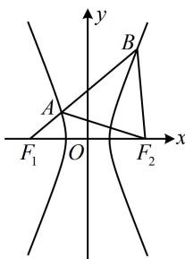

> [!faq]- 《第2节 双曲线的焦点三角形相关问题》参考答案
>
> > [!success]- **【答案】** $\sqrt{7}$
>
> > [!note]- **【分析】**
> > 本题未单列分析。
>
> > [!note]- **【解析】**
> > 解析：涉及双曲线上的点和左、右焦点，优先考虑定义，如图，由双曲线定义， $\left|BF_{1}\right|-\left|BF_{2}\right|=2a$ ①，
> > 又 $\triangle ABF_{2}$ 是正三角形，所以 $\left|BF_{2}\right|=\left|AB\right|$ 代入①得： $\left|BF_{1}\right|-\left|BF_{2}\right|=\left|BF_{1}\right|-\left|AB\right|=\left|AF_{1}\right|=2a$ 因为点 A 也在双曲线上，所以 $\left|AF_{2}\right|-\left|AF_{1}\right|=2a$ 故 $\left|AF_{2}\right|=\left|AF_{1}\right|+2a=4a$ ，正三角形除已知边长关系外，故 $\left|AF_2\right| = \left|AF_1\right| + 2a = 4a$ ，正三角形除已知边长关系外，还知道角，故可在 $\triangle AF_1F_2$ 中由余弦定理建立方程求离心率，由题意， $\angle BAF_{2} = 60^{\circ}$ ， $\angle F_{1}AF_{2} = 180^{\circ} - \angle BAF_{2} = 120^{\circ}$ ，在 $\triangle AF_{1}F_{2}$ 中，由余弦定理， $\left|F_{1}F_{2}\right|^{2} = \left|AF_{1}\right|^{2} + \left|AF_{2}\right|^{2} - 2\left|AF_{1}\right|\cdot \left|AF_{2}\right|\cdot \cos \angle F_{1}AF_{2}$ ，所以 $4c^{2} = 4a^{2} + 16a^{2} - 2\times 2a\times 4a\times \cos 120^{\circ}$ ，整理得： $\frac{c^2}{a^2} = 7$ ，故离心率 $e = \frac{c}{a} = \sqrt{7}$ 。
> >
> > 
