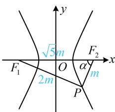

> [!faq]- 《第2节 双曲线的焦点三角形相关问题》参考答案
>
> > [!success]- **【答案】** C
>
> > [!note]- **【分析】**
> > 本题未单列分析。
>
> > [!note]- **【解析】**
> > ## 5. (2024·天津卷·★★★)
> >
> > 双曲线 $\frac{x^2}{a^2} -\frac{y^2}{b^2} = 1(a > 0,b > 0)$ 的左、右焦点分别为 $F_{1}$ ， $F_{2}$ ， $P$ 是双曲线右支上一点，且直线 $PF_{2}$ 的斜率为2， $\triangle PF_1F_2$ 是面积为8的直角三角形，则双曲线的方程为（）A. $\frac{x^2}{8} -\frac{y^2}{2} = 1$ B. $\frac{x^2}{8} -\frac{y^2}{4} = 1$ C. $\frac{x^2}{2} -\frac{y^2}{8} = 1$ D. $\frac{x^2}{4} -\frac{y^2}{8} = 1$
> >
> > 解析：条件涉及 $PF_{2}$ 的斜率，怎样翻译？有 $\triangle PF_{1}F_{2}$ 为 Rt $\triangle$ ，当然到此三角形中研究边的关系，设直线 $PF_{2}$ 的倾斜角为 $\alpha$ ，则 $\angle PF_{2}F_{1} = \alpha$ ，由题意， $k_{PF_2} = \tan \alpha = 2$ ，又因为 $\triangle PF_{1}F_{2}$ 是直角三角形，且如图，只能 $\angle F_{1}PF_{2} = 90^{\circ}$ ，所以 $\tan \alpha = \frac{|PF_1|}{|PF_2|}$ ，故 $\frac{|PF_1|}{|PF_2|} = 2$ ，设 $|PF_2| = m$ ，则 $|PF_1| = 2m$ ， $|F_1F_2| = \sqrt{|PF_1|^2 + |PF_2|^2} = \sqrt{5}m$ ，还剩 $\triangle PF_{1}F_{2}$ 面积为8没翻译，由此可求出 $m$ ，得到 $\triangle PF_{1}F_{2}$ 的三边，由题意， $S_{\triangle PF_1F_2} = \frac{1}{2}|PF_1| \cdot |PF_2| = \frac{1}{2} \cdot 2m \cdot m = m^2 = 8$ ，所以 $m = 2\sqrt{2}$ ，由双曲线定义， $|PF_1| - |PF_2| = 2a$ ，所以 $2m - m = 2a$ ，故 $a = \frac{m}{2} = \sqrt{2}$ ，又因为 $|F_1F_2| = 2c = \sqrt{5}m$ ，所以 $c = \frac{\sqrt{5}}{2}m = \sqrt{10}$ ，故 $b = \sqrt{c^2 - a^2} = 2\sqrt{2}$ ，所以双曲线的方程为 $\frac{x^2}{2} - \frac{y^2}{8} = 1$ 。
> >
> > 
