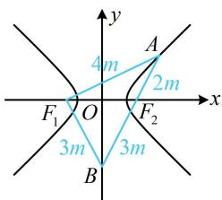

> [!faq]- 《第2节 双曲线的焦点三角形相关问题》参考答案
>
> > [!success]- **【答案】** $\frac{3\sqrt{5}}{5}$
>
> > [!note]- **【分析】**
> > 本题未单列分析。
>
> > [!note]- **【解析】**
> > 解析：如图，条件中有 $\overrightarrow{F_2A} = -\frac{2}{3}\overrightarrow{F_2B}$ ，不妨设一段长度，看能否表示其余线段的长，设 $\left|AF_2\right| = 2m$ ，因为 $\overrightarrow{F_2A} = -\frac{2}{3}\overrightarrow{F_2B}$ ，所以 $\left|BF_2\right| = 3m$ ，故 $\left|AB\right| = \left|AF_2\right| + \left|BF_2\right| = 5m$ ，由对称性， $\left|BF_1\right| = \left|BF_2\right| = 3m$ ，又 $\overrightarrow{F_1A} \perp \overrightarrow{F_1B}$ ，所以 $\left|AF_1\right| = \sqrt{\left|AB\right|^2 - \left|BF_1\right|^2} = 4m$ ， $\left|AF_1\right|$ 和 $\left|AF_2\right|$ 都有了，结合双曲线的定义可计算 $\triangle ABF_1$ 的各边，则可用“双余弦法”建立方程，由图可知 $A$ 在双曲线 $C$ 的右支上，所以 $\left|AF_1\right| - \left|AF_2\right|$ $= 2m = 2a$ ，从而 $m = a$ ，故 $\left|BF_1\right| = \left|BF_2\right| = 3a$ ，又 $\left|F_1F_2\right| = 2c$ ，所以在 $\triangle BF_1F_2$ 中，由余弦定理推论， $\cos \angle F_1BF_2 = \frac{\left|BF_1\right|^2 + \left|BF_2\right|^2 - \left|F_1F_2\right|^2}{2\left|BF_1\right|\cdot\left|BF_2\right|} = \frac{9a^2 + 9a^2 - 4c^2}{2\times 3a\times 3a}$ $= \frac{9a^2 - 2c^2}{9a^2}$ ，在 $\triangle ABF_1$ 中， $\cos \angle ABF_1 = \frac{\left|BF_1\right|}{\left|AB\right|} = \frac{3m}{5m} = \frac{3}{5}$ ，因为 $\angle ABF_1 = \angle F_1BF_2$ ，所以 $\frac{9a^2 - 2c^2}{9a^2} = \frac{3}{5}$ ，故双曲线 $C$ 的离心率 $e = \frac{c}{a} = \frac{3\sqrt{5}}{5}$ .
> >
> > 
