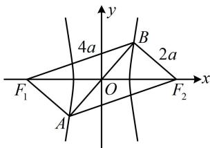

> [!faq]- 《第2节 双曲线的焦点三角形相关问题》参考答案
>
> > [!success]- **【答案】** D
>
> > [!note]- **【分析】**
> > 本题未单列分析。
>
> > [!note]- **【解析】**
> > 解析：如图，由双曲线的对称性可知 $A$ ， $B$ 关于原点对称，即 $O$ 是线段 $AB$ 的中点，又因为 $O$ 是 $F_{1}F_{2}$ 的中点，所以 $AF_{1}BF_{2}$ 是平行四边形，故 $\left|F_2A\right| = \left|F_1B\right|$ ， $\left|F_1A\right| = \left|F_2B\right|$ ，条件涉及 $\left|F_1B\right|$ ， $\left|F_1A\right|$ ，这是双曲线上的点到焦点的距离，想到结合双曲线定义，求出这些线段的长，由题意， $\left|F_1B\right| = 2\left|F_1A\right|$ ，结合 $\left|F_1A\right| = \left|F_2B\right|$ 可得 $\left|F_1B\right| = 2\left|F_2B\right|$ ①，
> >
> > 由双曲线定义， $\left|F_{1}B\right|-\left|F_{2}B\right|=2a$ ，
> >
> > 与①联立可解得： $\left|F_{2}B\right|=2a,\quad\left|F_{1}B\right|=4a$
> >
> > 所以 $\left|F_{1}A\right|=\left|F_{2}B\right|=2a,\quad\left|F_{2}A\right|=\left|F_{1}B\right|=4a,$
> >
> > 注意到 $\left|F_{1}F_{2}\right|=2c$ ，所以 $\triangle F_{1}BF_{2}$ 三边都有了，若能求出它的一个内角，就能用余弦定理建立方程求离心率。剩下的条件 $\overrightarrow{F_{2}A}\cdot\overrightarrow{F_{2}B}=4a^{2}$ 刚好能与角联系起来，我们来翻译它，
> > 由题意， $\overrightarrow{F_{2}A}\cdot\overrightarrow{F_{2}B}=4a^{2}\Rightarrow\left|\overrightarrow{F_{2}A}\right|\cdot\left|\overrightarrow{F_{2}B}\right|\cdot\cos\angle BF_{2}A=4a^{2}$ $\Rightarrow 4a \cdot 2a \cdot \cos \angle BF_{2}A = 4a^{2} \Rightarrow \cos \angle BF_{2}A = \frac{1}{2}$ 结合 $\angle BF_{2}A \in (0, \pi)$ 可得 $\angle BF_{2}A = \frac{\pi}{3}$ ,
> > 由 $AF_{1}BF_{2}$ 是平行四边形可得 $\angle F_{1}BF_{2} = \pi - \angle BF_{2}A = \frac{2\pi}{3}$ 在 $\triangle F_{1}BF_{2}$ 中，由余弦定理， $\left|F_{1}F_{2}\right|^{2}=\left|F_{1}B\right|^{2}+\left|F_{2}B\right|^{2}-2\left|F_{1}B\right|\left|F_{2}B\right|\cos\angle F_{1}BF_{2}$ 所以 $4c^{2}=(4a)^{2}+(2a)^{2}-2\cdot4a\cdot2a\cdot\cos\frac{2\pi}{3}$ 化简得双曲线的离心率 $e=\frac{c}{a}=\sqrt{7}$
> >
> > 
