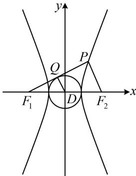

> [!faq]- 《第2节 双曲线的焦点三角形相关问题》参考答案
>
> > [!success]- **【答案】** A
>
> > [!note]- **【分析】**
> > 本题未单列分析。
>
> > [!note]- **【解析】**
> > 解析：如图，设 $PF_{1}$ 与圆 D 相切于点 Q，则 $DQ \perp PF_{1}$ ，
> > 且 $\left|DQ\right|=a,\quad\left|DF_{1}\right|=c,\quad\left|QF_{1}\right|=\sqrt{\left|DF_{1}\right|^{2}-\left|DQ\right|^{2}}=b,$ $\left|F_{1}F_{2}\right|=2c$ ，条件 $S_{\triangle PF_{1}F_{2}}=4a^{2}$ 怎样翻译？注意到 $\sin\angle PF_{1}F_{2}$ 可放到 Rt△DQF₁ 中来求，故用 $\angle PF_{1}F_{2}$ 来计算 $S_{\triangle PF_{1}F_{2}}$ ，由图可知， $\sin\angle PF_{1}F_{2}=\frac{|DQ|}{|DF_{1}|}=\frac{a}{c}$ ，所以 $S_{\triangle PF_{1}F_{2}}=\frac{1}{2}|PF_{1}|\cdot|F_{1}F_{2}|\cdot\sin\angle PF_{1}F_{2}=\frac{1}{2}|PF_{1}|\cdot2c\cdot\frac{a}{c}=a|PF_{1}|$ 又由题意， $S_{\triangle PF_{1}F_{2}}=4a^{2}$ ，所以 $a|PF_{1}|=4a^{2}$ ，故 $|PF_{1}|=4a$ ，
> > 由双曲线定义， $\left|PF_{1}\right|-\left|PF_{2}\right|=2a$ 所以 $\left|PF_{2}\right|=\left|PF_{1}\right|-2a=2a$ 注意到 $\left|PF_{2}\right|=2\left|DQ\right|$ ，于是联想到 DQ 是 $\triangle PF_{1}F_{2}$ 的中位线，故考虑由此继续分析几何关系，建立方程求离心率，
> > 因为 $\left|PF_{2}\right|=2\left|DQ\right|$ ，且 D 是 $F_{1}F_{2}$ 的中点，所以 $DQ\parallel PF_{2}$ ，
> > 结合 $DQ \perp PF_{1}$ 可得 $PF_{2} \perp PF_{1}$ ，所以在 $\triangle PF_{1}F_{2}$ 中，
> >
> > $\left|PF_{1}\right|^{2} + \left|PF_{2}\right|^{2} = \left|F_{1}F_{2}\right|^{2}$ ，所以 $16a^{2} + 4a^{2} = 4c^{2}$
> >
> > 化简得双曲线 $C$ 的离心率 $e = \frac{c}{a} = \sqrt{5}$
> >
> > 
