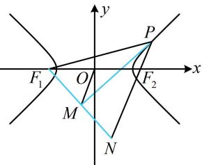

> [!faq]- 《第2节 双曲线的焦点三角形相关问题》参考答案
>
> > [!success]- **【答案】** 2
>
> > [!note]- **【分析】**
> > 本题未单列分析。
>
> > [!note]- **【解析】**
> > 解析：如图，PM既是 $\angle F_{1}PF_{2}$ 的平分线，又是 $F_{1}N$ 的垂线，想到三线合一，可构造等腰三角形，延长 $F_{1}M$ 和 $PF_{2}$ 交于点N，由题意，PM平分 $\angle F_{1}PF_{2}$ ， $PM\perp F_{1}N$ ，
> > 所以 $\left|PF_{1}\right|=\left|PN\right|$ ，且M为 $F_{1}N$ 的中点，涉及中点，考虑中位线，结合O为 $F_{1}F_{2}$ 的中点可得 $\left|OM\right|=\frac{1}{2}\left|F_{2}N\right|$ $=\frac{1}{2}(\left|PN\right|-\left|PF_{2}\right|)=\frac{1}{2}(\left|PF_{1}\right|-\left|PF_{2}\right|)=\frac{1}{2}\times2a=a=2.$
> >
> > 
>
> > [!tip]- **【反思】**
> > 本题构造等腰三角形的方法眼熟吧？之前椭圆涉及角平分线的问题也用过类似的构造方法.
