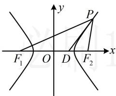

> [!faq]- 《第2节 双曲线的焦点三角形相关问题》参考答案
>
> > [!success]- **【答案】** B
>
> > [!note]- **【分析】**
> > 本题未单列分析。
>
> > [!note]- **【解析】**
> > 解析：如图，题干给出了 $\left|PF_{1}\right|+\left|PF_{2}\right|=8$ ，结合双曲线定义可求得 $\left|PF_{1}\right|$ 和 $\left|PF_{2}\right|$ ，
> >
> > 不妨设 $P$ 在右支，由题意， $\left\{ \begin{array}{l} \left|PF_1\right| + \left|PF_2\right| = 8 \\ \left|PF_1\right| - \left|PF_2\right| = 2a \end{array} \right.$
> >
> > 所以 $\left|PF_1\right| = 4 + a$ ， $\left|PF_2\right| = 4 - a$ ，注意到 $\angle F_{1}PF_{2}$ 给了大小，可用小三角形面积和等于大三角形面积建立方程求 $a$
> >
> > 因为 $PD$ 是 $\angle F_{1}PF_{2}$ 的平分线，且 $\angle F_{1}PF_{2} = \frac{\pi}{3}$
> >
> > 所以 $\angle F_{1}PD = \angle F_{2}PD = \frac{\pi}{6}$ ，因为 $S_{\triangle PF_1D} + S_{\triangle PF_2D} = S_{\triangle PF_1F_2}$
> >
> > 所以 $\frac{1}{2}\big|PF_1\big|\cdot \big|PD\big|\cdot \sin \angle F_1PD + \frac{1}{2}\big|PF_2\big|\cdot \big|PD\big|\cdot \sin \angle F_2PD =$
> >
> > $$
> > \frac {1}{2} \left| P F _ {1} \right| \cdot \left| P F _ {2} \right| \cdot \sin \angle F _ {1} P F _ {2}
> > $$
> >
> > 即 $\frac{1}{2} (4 + a)\cdot \sqrt{3}\cdot \sin \frac{\pi}{6} +\frac{1}{2} (4 - a)\cdot \sqrt{3}\cdot \sin \frac{\pi}{6} =$
> >
> > $\frac{1}{2}(4+a)(4-a)\sin\frac{\pi}{3}$ ，解得： $a=2\sqrt{2}$ ，
> >
> > 再求 $b$ ，此时 $\triangle PF_{1}F_{2}$ 已知两边及夹角了，可先由余弦定理求 $\left|F_{1}F_{2}\right|$ ，从而得到 $c$ ，那么 $b$ 也就有了，
> >
> > 在 $\triangle PF_{1}F_{2}$ 中，由余弦定理，
> >
> > $$
> > \left| F _ {1} F _ {2} \right| ^ {2} = \left| P F _ {1} \right| ^ {2} + \left| P F _ {2} \right| ^ {2} - 2 \left| P F _ {1} \right| \cdot \left| P F _ {2} \right| \cdot \cos \angle F _ {1} P F _ {2}
> > $$
> >
> > 所以 $4c^{2} = (4 + a)^{2} + (4 - a)^{2} - 2(4 + a)(4 - a)\cos 60^{\circ}$
> >
> > $= 16 + 3a^{2} = 40$ ，从而 $c^2 = 10$ ，故 $b^{2} = c^{2} - a^{2} = 2$
> >
> > 所以双曲线 E 的方程为 $\frac{x^{2}}{8}-\frac{y^{2}}{2}=1$ .
> >
> > 
>
> > [!tip]- **【反思】**
> > 本题对角平分线的翻译与上一题不一样，为什么？因为本题已知顶角，就可用解三角形中的等面积法构造方程，所以解析几何难题常与解三角形结合.
