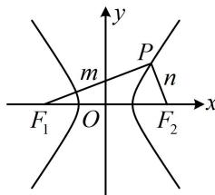

> [!faq]- 《第2节 双曲线的焦点三角形相关问题》例题解析
>
> > [!success]- **【答案】** 4
>
> > [!note]- **【分析】**
> > 本题未单列分析。
>
> > [!note]- **【解析】**
> > 解析：涉及焦点三角形，考虑用双曲线的定义处理，如图，设 $\left|PF_{1}\right|=m,\left|PF_{2}\right|=n$ ，则 $\left|m-n\right|=2a$ ①，条件 $PF_{1}\perp PF_{2}$ 怎样翻译？由于上面得到的是长度关系，所以考虑用勾股定理来翻译，
> >
> > 因为 $PF_{1} \perp PF_{2}$ ，所以 $m^2 + n^2 = \left|F_1F_2\right|^2 = 4(a^2 + 4)$ ②，
> >
> > 对比①和②发现，可通过配方求得 mn，面积就有了，
> >
> > 由②知 $m^2 + n^2 = (m - n)^2 + 2mn = 4a^2 + 16$ ③，
> >
> > 将式①代入式③可得 $4a^{2} + 2mn = 4a^{2} + 16$ ，所以 $mn = 8$ ，故 $S_{\triangle PF_1F_2} = \frac{1}{2} mn = 4$
> >
> > 
>
> > [!tip]- **【反思】**
> > 解析几何小题中对直角的常见翻译方法有：①勾股定理；
> > - **②**：斜率之积为-1；
> > - **③**：向量数量积等于0；
> > - **④**：斜边上的中线等于斜边的一半等.选择合适的方法前应先预判计算量.
