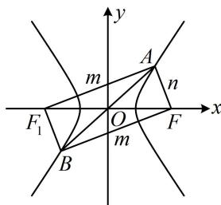

> [!faq]- 《第2节 双曲线的焦点三角形相关问题》例题解析
>
> > [!success]- **【答案】** D
>
> > [!note]- **【分析】**
> > 本题未单列分析。
>
> > [!note]- **【解析】**
> > 解析：先分析图形，在双曲线中给出右焦点，一定要关注左焦点，
> >
> > 如图，记左焦点为 $F_{1}$ ，由对称性， $AB$ 中点为 $O$ ，
> >
> > 又 $FF_{1}$ 的中点也是 $O$ ，所以四边形 $AF_{1}BF$ 是平行四边形，结合 $AF \perp BF$ 知四边形 $AF_{1}BF$ 是矩形，
> >
> > $$
> > \Delta A F F _ {1}
> > $$
> >
> > 故 $\left|AF_{1}\right|=m,\quad\left|AF\right|=n$ ，则 $\left|BF\right|=m$ ，由四边形 $AF_{1}BF$ 为矩形知 $\left|AB\right|=\left|FF_{1}\right|=2c$
> >
> > $\triangle ABF$ 的周长 $L = |AB| + |BF| + |AF| = 2c + m + n = 4a + 2c$ ，所以 $m + n = 4a$ ①，由双曲线定义， $\vert m - n\vert = 2a$ ②，又 $AF_{1}\bot AF$ ，所以 $m^2 +n^2 = 4c^2$ ③，
> >
> > 要求离心率，应消去 $m$ 和 $n$ ，建立 $a$ 和 $c$ 的关系式，
> >
> > 将①和②平方相加得 $(m + n)^2 + (m - n)^2 = 16a^2 + 4a^2$ ，整理得： $m^2 + n^2 = 10a^2$ ，代入③可得 $10a^2 = 4c^2$ ，故离心率 $e = \frac{c}{a} = \frac{\sqrt{10}}{2}$ .
> >
> > 
>
> > [!tip]- **【反思】**
> > 似曾相识吧？没错，椭圆也是类似的处理方法，再一次说明了两者解题的共性.
