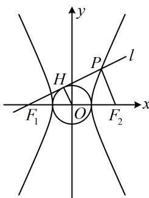

> [!faq]- 《第2节 双曲线的焦点三角形相关问题》例题解析
>
> > [!success]- **【答案】** B
>
> > [!note]- **【分析】**
> > 本题未单列分析。
>
> > [!note]- **【解析】**
> > A. $\frac{\sqrt{13}}{2}$ B. $\sqrt{5}$ C. $2\sqrt{5}$ D. $\sqrt{13}$
> >
> > 解析：如图，因为 $\left|F_{1}P\right|=2\left|F_{1}H\right|$ ，所以H为 $F_{1}P$ 的中点，涉及中点，想到中位线，又因为原点O为 $F_{1}F_{2}$ 的中点，所以 $\left|PF_{2}\right|=2\left|OH\right|=2a$ ，且 $PF_{2}//OH$ ，求出了 $\left|PF_{2}\right|$ ，可用定义求 $\left|PF_{1}\right|$ ，因为 $\left|PF_{1}\right|-\left|PF_{2}\right|=2a$ ，所以 $\left|PF_{1}\right|=\left|PF_{2}\right|+2a=4a$ ，因为l是圆的切线，所以 $OH\perp PF_{1}$ ，结合 $PF_{2}//OH$ 可得 $PF_{2}\perp PF_{1}$ ，于是可在 $\triangle PF_{1}F_{2}$ 中用勾股定理建立方程求离心率，
> > 所以 $\left|PF_{1}\right|^{2}+\left|PF_{2}\right|^{2}=\left|F_{1}F_{2}\right|^{2}$ ，从而 $16a^{2}+4a^{2}=4c^{2}$ ，整理得： $\frac{c^{2}}{a^{2}}=5$ ，故离心率 $e=\frac{c}{a}=\sqrt{5}$ .
> >
> > 
>
> > [!tip]- **【反思】**
> > 当出现中点时，可往中位线方向思考，而原点 O 是 $F_{1}F_{2}$ 的中点，常作为构造中位线的隐藏条件.
