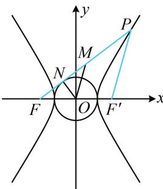

> [!faq]- 《第2节 双曲线的焦点三角形相关问题》例题解析
>
> > [!success]- **【答案】** -1
>
> > [!note]- **【分析】**
> > 本题未单列分析。
>
> > [!note]- **【解析】**
> > 解析：涉及双曲线的左焦点 $F$ ，我们把右焦点 $F'$ 也取出来，条件中有中点，想到构造中位线，如图， $M$ 为 $PF$ 的中点， $O$ 为 $FF'$ 的中点，所以 $\left|MO\right| = \frac{1}{2}\left|PF'\right|$ ①，
> >
> > 再来看 $|MN|$ ，可想办法转化到 $|PF|$ 上，结合双曲线定义来算 $|MN| - |MO|$ ， $|MN| = |MF| - |FN| = \frac{1}{2} |PF| - |FN|$ ②，  
> > 因为 $PF$ 是圆的切线，所以 $ON \perp PF$ ，又 $|ON| = 3$ ， $|OF| = c = \sqrt{9 + 16} = 5$ ，所以 $|FN| = \sqrt{|OF|^2 - |ON|^2} = 4$ ，  
> > 代入②得： $|MN| = \frac{1}{2} |PF| - 4$ ③，  
> > 由①③可得： $|MN| - |MO| = \frac{1}{2} |PF| - 4 - \frac{1}{2} |PF'| = \frac{1}{2} (|PF| - |PF'|) - 4 = \frac{1}{2} \times 6 - 4 = -1.$
> >
> > 
