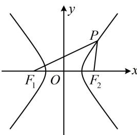

> [!faq]- 《第2节 双曲线的焦点三角形相关问题》例题解析
>
> > [!success]- **【答案】** A
>
> > [!note]- **【分析】**
> > 本题未单列分析。
>
> > [!note]- **【解析】**
> > 解析：涉及 $\left|PF_{1}\right|$ 和 $\left|PF_{2}\right|$ ，考虑双曲线定义，由题意， $\left\{\begin{aligned}|PF_{1}|&=3\left|PF_{2}\right|\\ |PF_{1}|-|PF_{2}|&=2a\end{aligned}\right.$ ，所以 $\left\{\begin{aligned}|PF_{1}|&=3a\\ |PF_{2}|&=a\end{aligned}\right.$
> >
> > 还剩 $\angle F_{1}PF_{2} = 60^{\circ}$ 这个条件没用，可在 $\triangle PF_{1}F_{2}$ 中由余弦定理建立方程求离心率，由余弦定理， $\left|F_{1}F_{2}\right|^{2} = \left|PF_{1}\right|^{2} + \left|PF_{2}\right|^{2} - 2\left|PF_{1}\right|\cdot \left|PF_{2}\right|\cdot \cos \angle F_{1}PF_{2}$ ，所以 $4c^{2} = 9a^{2} + a^{2} - 2\times 3a\times a\times \cos 60^{\circ}$ ，整理得： $\frac{c^2}{a^2} = \frac{7}{4}$ ，故 $C$ 的离心率 $e = \frac{c}{a} = \frac{\sqrt{7}}{2}$ .
> >
> > 
