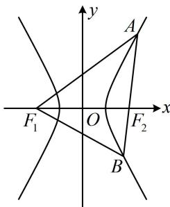

> [!faq]- 《第2节 双曲线的焦点三角形相关问题》例题解析
>
> > [!success]- **【答案】** C
>
> > [!note]- **【分析】**
> > 本题未单列分析。
>
> > [!note]- **【解析】**
> > 解析：如图，涉及双曲线上的点和两个焦点，考虑定义，由题意， $\left\{\begin{aligned}|AF_{1}|-|AF_{2}|&=2a\\ |BF_{1}|-|BF_{2}|&=2a\end{aligned}\right.$ 又 $\left|AB\right|=\left|AF_{1}\right|$ ，代入①可得 $\left|AB\right|-\left|AF_{2}\right|=\left|BF_{2}\right|=2a$ ，代入②可得 $\left|BF_{1}\right|-2a=2a$ ，所以 $\left|BF_{1}\right|=4a$
> >
> > 对于 $\cos \angle AF_1B = \frac{1}{4}$ 这个条件，我们能想到用余弦定理建立方程求离心率，但若在 $\triangle AF_1B$ 中用，它的三边没有完全求出来，而 $\triangle BF_{1}F_{2}$ 三边均已知了，所以转化到 $\triangle BF_{1}F_{2}$ 中来用，  
> > 因为 $|AB| = |AF_1|$ ，所以 $\angle F_1BF_2 = \angle AF_1B$ ，故 $\cos \angle F_1BF_2 = \cos \angle AF_1B = \frac{1}{4}$ 由余弦定理， $\left|F_1F_2\right|^2 = \left|BF_1\right|^2 +\left|BF_2\right|^2 -2\left|BF_1\right|\cdot \left|BF_2\right|\cdot \cos \angle F_1BF_2$ 即 $4c^{2} = 16a^{2} + 4a^{2} - 2\times 4a\times 2a\times \frac{1}{4}$ ，整理得： $\frac{c^2}{a^2} = 4$ ，所以离心率 $e = \frac{c}{a} = 2$
> >
> > 
>
> > [!tip]- **【反思】**
> > 从上面两道题可以看出，焦点三角形中的角度（非直角）类条件，常用余弦定理翻译成 $a, b, c$ 的方程，求离心率.
