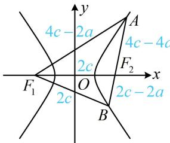

> [!faq]- 《第2节 双曲线的焦点三角形相关问题》例题解析
>
> > [!success]- **【答案】** $\frac{5}{3}$
>
> > [!note]- **【分析】**
> > 本题未单列分析。
>
> > [!note]- **【解析】**
> > 解析：如图，涉及双曲线上的点和两个焦点，考虑结合定义求有关线段的长，
> > 由题意， $\left|BF_{1}\right|=\left|F_{1}F_{2}\right|=2c$ ，又 $\left|BF_{1}\right|-\left|BF_{2}\right|=2a$ ，所以 $\left|BF_{2}\right|=\left|BF_{1}\right|-2a=2c-2a$ 因为 $\overrightarrow{AF_{2}} = 2\overrightarrow{F_{2}B}$ ，所以 $\left|AF_{2}\right| = 2\left|BF_{2}\right| = 4c - 4a$ ，结合 $\left|AF_{1}\right| - \left|AF_{2}\right| = 2a$ 可得 $\left|AF_{1}\right| = \left|AF_{2}\right| + 2a = 4c - 2a$ ，
> > 所有线段都求出来了，可抓住 $\angle AF_{2}F_{1}$ 和 $\angle BF_{2}F_{1}$ 互补，用双余弦法建立方程求离心率，
> >
> > 因为 $\angle AF_2F_1 = \pi -\angle BF_2F_1$ ，所以 $\cos \angle AF_2F_1 = \cos (\pi -\angle BF_2F_1) = -\cos \angle BF_2F_1,$ 从而 $\frac{\left|AF_2\right|^2 + \left|F_1F_2\right|^2 - \left|AF_1\right|^2}{2\left|AF_2\right|\cdot\left|F_1F_2\right|} = -\frac{\left|BF_2\right|^2 + \left|F_1F_2\right|^2 - \left|BF_1\right|^2}{2\left|BF_2\right|\cdot\left|F_1F_2\right|}$ ，故 $\frac{\left|AF_2\right|^2 + \left|F_1F_2\right|^2 - \left|AF_1\right|^2}{\left|AF_2\right|} = -\frac{\left|BF_2\right|^2 + \left|F_1F_2\right|^2 - \left|BF_1\right|^2}{\left|BF_2\right|},$
> >
> > 所以 $\frac{(4c - 4a)^2 + 4c^2 - (4c - 2a)^2}{4c - 4a} = -\frac{(2c - 2a)^2 + 4c^2 - 4c^2}{2c - 2a}$
> >
> > 整理得： $3c^{2} - 8ac + 5a^{2} = 0$ ，从而 $(3c - 5a)(c - a) = 0$ ，故 $\frac{c}{a} = \frac{5}{3}$ 或1（舍去），所以双曲线的离心率为 $\frac{5}{3}$
> >
> >
> > 
