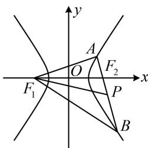

> [!faq]- 《第2节 双曲线的焦点三角形相关问题》例题解析
>
> > [!success]- **【答案】** A
>
> > [!note]- **【分析】**
> > 本题未单列分析。
>
> > [!note]- **【解析】**
> > 解析：如图，给出 $|AB| = \sqrt{2}|F_1P|$ ，可由此设出 $|AB|$ ，并尝试求其它线段的长，设 $|AB| = 2m$ ，则 $|AP| = m$ ，又 $|AB| = \sqrt{2}|F_1P|$ ，所以 $|F_1P| = \sqrt{2} m$ ，在 $\triangle AF_1P$ 中， $|AF_1|^2 = |AP|^2 + |PF_1|^2 - 2|AP| \cdot |PF_1| \cdot \cos \angle F_1PA = m^2 + 2m^2 - 2m \cdot \sqrt{2}m \cdot \cos 45^\circ = m^2$ ，所以 $|AF_1| = m$ ，且 $|AF_1|^2 + |AP|^2 = 2m^2 = |F_1P|^2$ ，故 $AF_1 \perp AP$ ，所以 $|BF_1| = \sqrt{|AF_1|^2 + |AB|^2} = \sqrt{5}m$ ，要求离心率，得建立 $a, b, c$ 的方程，故考虑结合双曲线定义把上述线段用 $a, b, c$ 表示，
> >
> > 由图可知 $\left\{ \begin{array}{l} \left|AF_1\right| - \left|AF_2\right| = 2a \\ \left|BF_1\right| - \left|BF_2\right| = 2a \end{array} \right.$ ，两式相加得： $\left|AF_1\right| + \left|BF_1\right| - \left(\left|AF_2\right| + \left|BF_2\right|\right) = \left|AF_1\right| + \left|BF_1\right| - \left|AB\right| = 4a$ ，
> >
> > 所以 $m + \sqrt{5} m - 2m = 4a$ ，故 $m = \frac{4a}{\sqrt{5} - 1} = (\sqrt{5} + 1)a$
> >
> > 所以 $\left|AF_1\right| = (\sqrt{5} + 1)a$ ， $\left|AF_2\right| = \left|AF_1\right| - 2a = (\sqrt{5} - 1)a$
> >
> > 因为 $AF_{1} \perp AF_{2}$ ，所以 $\left|AF_{1}\right|^{2} + \left|AF_{2}\right|^{2} = \left|F_{1}F_{2}\right|^{2}$ ，
> >
> > 从而 $(\sqrt{5} + 1)^2 a^2 + (\sqrt{5} - 1)^2 a^2 = 4c^2$ ，整理得： $\frac{c^2}{a^2} = 3$ ，故离心率 $e = \frac{c}{a} = \sqrt{3}$ .
> >
> > 
>
> > [!tip]- **【反思】**
> > 在双曲线离心率问题中，若给出两条线段的比例关系，则可设其中一条线段的长，并尝试将图形中的其它线段也用设的变量来表示，再结合双曲线的定义把它们转换成 $a, b, c$ ，建立方程求离心率.
