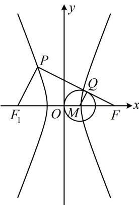

> [!faq]- 《第2节 双曲线的焦点三角形相关问题》例题解析
>
> > [!success]- **【答案】** $1 + \sqrt{3}$
>
> > [!note]- **【分析】**
> > 本题未单列分析。
>
> > [!note]- **【解析】**
> > 解法1：先分析图形的几何特征，双曲线中只给了右焦点，往往也需要关注左焦点，如图，记双曲线的左焦点为 $F_{1}$ ，因为 $\overrightarrow{PQ} = 2\overrightarrow{QF}$ ，所以 $\frac{|QF|}{|PF|} = \frac{1}{3}$ ，有了点 $Q$ 在 $PF$ 上的位置，我们也来看看 $M$ 在 $FF_{1}$ 上的位置，
> >
> > 由题意，圆 $M$ 过原点，所以 $\left|MF\right| = \left|OF\right| - \left|OM\right| = c - \frac{c}{3} = \frac{2c}{3} = \frac{1}{3}\left|FF_1\right|$ ，从而 $\frac{\left|MF\right|}{\left|FF_1\right|} = \frac{1}{3} = \frac{\left|QF\right|}{\left|PF\right|}$ ，故 $MQ / / PF_1$ ，且 $\left|PF_1\right| = 3\left|QM\right| = 3\times \frac{c}{3} = c$ ，又 $PF$ 是圆 $M$ 的切线，所以 $MQ \perp PF$ ，故 $PF_1 \perp PF$ ，接下来可结合双曲线定义，把 $\left|PF\right|$ 求出来，在 $\triangle PFF_1$ 中用勾股定理建立方程求离心率，因为 $\left|PF\right| - \left|PF_1\right| = 2a$ ，所以 $\left|PF\right| = \left|PF_1\right| + 2a = c + 2a$ ，因为 $PF_1 \perp PF$ ，所以 $\left|PF_1\right|^2 + \left|PF\right|^2 = \left|FF_1\right|^2$
> >
> > $$
> > c ^ {2} + (c + 2 a) ^ {2} = 4 c ^ {2}
> > $$
> >
> > $$
> > c ^ {2} - 2 a c - 2 a ^ {2} = 0
> > $$
> >
> > 两端同除以 $a^2$ 可得 $e^2 - 2e - 2 = 0$ ，解得： $e = 1 \pm \sqrt{3}$ ，又 $e > 1$ ，所以 $e = 1 + \sqrt{3}$ 。
> > 解法2：按解法1得到 $\left|PF_1\right| = c$ 和 $PF_1 \perp PF$ 后，也可用勾股定理求 $\left|PF\right|$ ，由 $\triangle PFF_1$ 的三边算离心率， $\left|PF\right| = \sqrt{\left|FF_1\right|^2 - \left|PF_1\right|^2} = \sqrt{3}c$ ，所以 $e = \frac{c}{a} = \frac{2c}{2a} = \frac{\left|FF_1\right|}{\left\|\left|PF\right| - \left|PF_1\right|\right\|} = \frac{2c}{\left|\sqrt{3}c - c\right|} = 1 + \sqrt{3}$ 。
> >
> > 
>
> > [!tip]- **【反思】**
> > - **①**：解析几何中遇到线段比例的条件，构造相似比是一个值得考虑的方向；
> > - **②**：焦点三角形 $PF_{1}F_{2}$ 条件下求双曲线的离心率，若能分析三边比值关系，则可代公式 $e = \frac{|F_1F_2|}{\|PF_1| - |PF_2\|}$ 来算.
