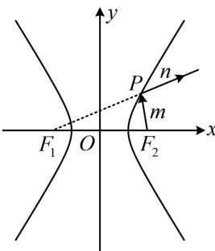
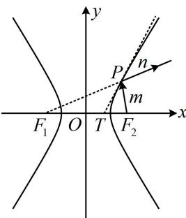
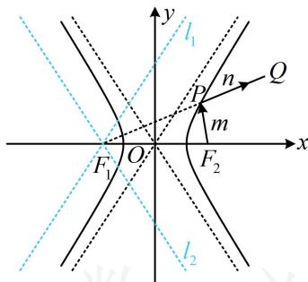
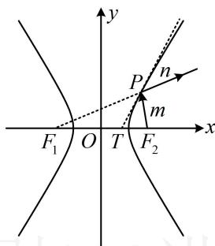

> [!faq]- 《第2节 双曲线的焦点三角形相关问题》例题解析
>
> > [!success]- **【答案】** C
>
> > [!note]- **【分析】**
> > 本题未单列分析。
>
> > [!note]- **【解析】**
> > A. 射线 $n$ 所在直线的斜率 $k \in \left(-\frac{4}{3}, \frac{4}{3}\right)$ B. 当 $m \perp n$ 时， $\left|PF_1\right| \cdot \left|PF_2\right| = 32$ C. 当射线 $n$ 过点 $Q(7,5)$ 时，光线由 $F_2$ 到 $P$ ，再到 $Q$ 经过的路程为 13  
> > D. 若 $T(1,0)$ ，直线 $PT$ 与 $C$ 相切，则 $\left|PF_2\right| = 12$
> >
> >   
> > 图1
> >
> >   
> > 图2
> >
> > 解析：A项，如下图1，射线 $n$ 的斜率即为直线 $PF_{1}$ 的斜率，当 $P$ 在双曲线右支上运动时， $PF_{1}$ 可从 $l_{2}$ 绕点 $F_{1}$ 逆时针旋转至 $l_{1}$ （临界状态均不可取）， $l_{1}$ 、 $l_{2}$ 分别与渐近线平行，它们的斜率分别为 $\frac{4}{3}$ 和 $-\frac{4}{3}$ ，所以 $k \in \left(-\frac{4}{3}, \frac{4}{3}\right)$ ，故A项正确；B项， $m \perp n$ 即为 $PF_{1} \perp PF_{2}$ ，翻译垂直关系，可用勾股定理，并结合双曲线定义，
> >
> > 所以 $\left\{ \begin{array}{l} \left|PF_1 \right|^2 + \left|PF_2 \right|^2 = \left|F_1F_2 \right|^2 = 4c^2 = 100 \\ \left|PF_1 \right| - \left|PF_2 \right| = 2a = 6 \end{array} \right.$ ，由①可得 $(\left|PF_1 \right| - \left|PF_2 \right|)^2 + 2\left|PF_1 \right| \cdot \left|PF_2 \right| = 100$ ③，将式②代入式③可得： $36 + 2\left|PF_1 \right| \cdot \left|PF_2 \right| = 100$ ，从而 $\left|PF_1 \right| \cdot \left|PF_2 \right| = 32$ ，故B项正确；C项，如下图1，已知点 $Q$ ，可求出 $\left|F_1Q \right|$ 的长，结合双曲线定义来算 $\left|PF_2 \right| + \left|PQ \right|$ ，由题意， $F_1(-5,0)$ ，所以 $\left|F_1Q \right| = \sqrt{(-5 - 7)^2 + (0 - 5)^2} = 13$ ，从而 $\left\{ \begin{array}{l} \left|PF_1 \right| + \left|PQ \right| = \left|F_1Q \right| = 13 \\ \left|PF_1 \right| - \left|PF_2 \right| = 6 \end{array} \right.$ ，故④-⑤消去 $\left|PF_1 \right|$ 可得 $\left|PQ \right| + \left|PF_2 \right| = 7$ ，故光线由 $F_2$ 到 $P$ ，再到 $Q$ 经过的路程为7，故C项错误；D项，由所给的双曲线光学性质， $PT$ 是切线 $\Rightarrow PT$ 是 $\angle F_1PF_2$ 的平分线，如下图2，由 $T$ 的坐标可求 $\left|TF_1 \right|$ 和 $\left|TF_2 \right|$ ，故用角平分线性质定理分析 $\left|PF_1 \right|$ 和 $\left|PF_2 \right|$ 的比值，结合定义求 $\left|PF_2 \right|$ ，因为 $T(1,0)$ ， $F_1(-5,0)$ ， $F_2(5,0)$ ，所以 $\left|TF_1 \right| = 6$ ， $\left|TF_2 \right| = 4$ ，由角平分线性质定理， $\frac{\left|PF_1 \right|}{\left|PF_2 \right|} = \frac{\left|TF_1 \right|}{\left|TF_2 \right|} = \frac{3}{2}$ ，所以 $\left|PF_1 \right| = \frac{3}{2}\left|PF_2 \right|$ ，代入 $\left|PF_1 \right| - \left|PF_2 \right| = 6$ 可得 $\frac{1}{2}\left|PF_2 \right| = 6$ ，从而 $\left|PF_2 \right| = 12$ ，故D项正确.
> >
> >
> >   
> > 图1
> >
> >   
> > 图2
