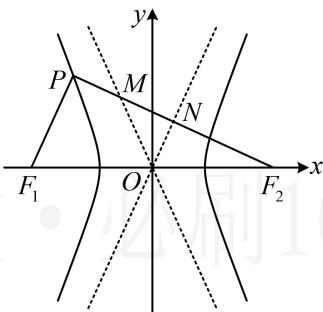

<!-- question-source:start -->
## 8. (2024·河北五校联考·★★★)

已知点 $P$ 是双曲线 $C: \frac{x^2}{a^2} - \frac{y^2}{b^2} = 1 (a > 0, b > 0)$ 左支上一点， $F_1$ ， $F_2$ 是双曲线的左、右两个焦点，且 $PF_1 \perp PF_2$ ， $PF_2$ 与两条渐近线相交与 $M$ ， $N$ 两点（如图），点 $N$ 恰好平分线段 $PF_2$ ，则双曲线的离心率是 \_\_\_\_.

<!-- question-source:end -->

![[Q00049425A1]]
