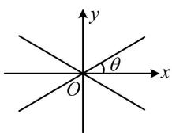
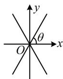

> [!faq]- 《第3节 双曲线渐近线相关问题》参考答案
>
> > [!success]- **【答案】** 详见解析
>
> > [!note]- **【分析】**
> > 本题未单列分析。
>
> > [!note]- **【解析】**
> > 解析：双曲线的渐近线为 $y=\pm\frac{b}{a}x$ ，它们的夹角为 $\frac{\pi}{3}$ 有如图 1 和图 2 所示的两种情况，下面分别考虑，
> >
> > 若为图1，则 $\theta = \frac{\pi}{6}$ ，所以 $\frac{b}{a} = \tan \frac{\pi}{6} = \frac{\sqrt{3}}{3}$
> >
> > 从而 $a = \sqrt{3} b$ ，故 $a^2 = 3b^2 = 3c^2 - 3a^2$
> >
> > 整理得： $\frac{c^2}{a^2} = \frac{4}{3}$ ，所以离心率 $e = \frac{c}{a} = \frac{2\sqrt{3}}{3}$
> >
> > 若为图2，则 $\theta = \frac{\pi}{3}$ ，所以 $\frac{b}{a} = \tan \frac{\pi}{3} = \sqrt{3}$
> >
> > 从而 $b = \sqrt{3} a$ ，故 $b^{2} = c^{2} - a^{2} = 3a^{2}$
> >
> > 整理得： $\frac{c^2}{a^2} = 4$ ，所以离心率 $e = \frac{c}{a} = 2$
> >
> >   
> > 图1
> >
> >   
> > 图2
