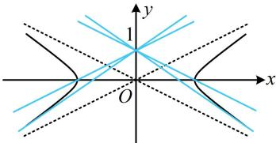

> [!faq]- 《第3节 双曲线渐近线相关问题》参考答案
>
> > [!success]- **【答案】** $y = \pm \frac{1}{2} x + 1, y = \pm \frac{\sqrt{2}}{2} x + 1$ （写出一条直线的方程即可）
>
> > [!note]- **【分析】**
> > 本题未单列分析。
>
> > [!note]- **【解析】**
> > 解析：分析直线与双曲线的交点个数，可借助渐近线来看．如图，满足①②的直线要么与渐近线平行，要么与双曲线相切，当直线 l 过点 $(0,1)$ 且与渐近线平行时，因为双曲线 $\frac{x^{2}}{4}-y^{2}=1$ 的渐近线斜率为 $\pm\frac{1}{2}$ ，
> >
> > 所以 l 的方程为 $y = \pm \frac{1}{2} x + 1$ ;
> >
> > 当直线 l 过点 $(0,1)$ 且与双曲线相切时，设其方程为 $y = kx + 1$ ，代入 $\frac{x^{2}}{4} - y^{2} = 1$ 整理得： $(1 - 4k^{2})x^{2} - 8kx - 8 = 0$ ，
> > 所以 $\left\{\begin{aligned}&1-4k^{2}\neq0\\&\Delta=(-8k)^{2}-4(1-4k^{2})\cdot(-8)=0\end{aligned}\right.$ ，解得： $k=\pm\frac{\sqrt{2}}{2}$ 故 l 的方程为 $y=\pm\frac{\sqrt{2}}{2}x+1$ .
> >
> > 
