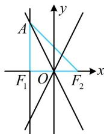

> [!faq]- 《第3节 双曲线渐近线相关问题》参考答案
>
> > [!success]- **【答案】** C
>
> > [!note]- **【分析】**
> > 本题未单列分析。
>
> > [!note]- **【解析】**
> > ## 4.（2022·天津卷·★★）
> >
> > 已知抛物线 $y^{2} = 4\sqrt{5} x$ ， $F_{1}$ ， $F_{2}$ 分别是双曲线 $\frac{x^2}{a^2} - \frac{y^2}{b^2} = 1 (a > 0, b > 0)$ 的左、右焦点，抛物线的准线过双曲线的左焦点 $F_{1}$ ，与双曲线的一条渐近线交于点 $A$ ，若 $\angle F_{1}F_{2}A = \frac{\pi}{4}$ ，则双曲线的标准方程为（）  
> > A. $\frac{x^2}{10} - y^2 = 1$ B. $x^{2} - \frac{y^{2}}{16} = 1$ C. $x^{2} - \frac{y^{2}}{4} = 1$ D. $\frac{x^2}{4} - y^2 = 1$
> >
> > 解析：抛物线的准线 $x = -\sqrt{5}$ 过双曲线的左焦点 $F_{1} \Rightarrow$ 双曲线的半焦距 $c = \sqrt{5} \Rightarrow a^{2} + b^{2} = 5$ ①，还差一个方程即可求出 $a, b$ ，可再翻译 $\angle F_{1}F_{2}A = \frac{\pi}{4}$ 这个条件，翻译成 $\left|AF_1\right| = \left|F_1F_2\right|$ 较简单，故算 $\left|AF_1\right|$ ，如图， $\angle F_{1}F_{2}A = \frac{\pi}{4} \Rightarrow \triangle AF_{1}F_{2}$ 是等腰直角三角形，所以 $\left|AF_1\right| = \left|F_1F_2\right| = 2\sqrt{5}$ ，故 $A(-\sqrt{5}, 2\sqrt{5})$ ，点 $A$ 在渐近线 $y = -\frac{b}{a} x$ 上，所以 $2\sqrt{5} = -\frac{b}{a} \cdot (-\sqrt{5})$ ②，联立①②解得： $\left\{ \begin{array}{l} a = 1 \\ b = 2 \end{array} \right.$ ，故双曲线的方程为 $x^{2} - \frac{y^{2}}{4} = 1$ 。
> >
> > 
