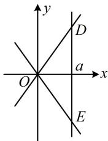

> [!faq]- 《第3节 双曲线渐近线相关问题》参考答案
>
> > [!success]- **【答案】** B
>
> > [!note]- **【分析】**
> > 本题未单列分析。
>
> > [!note]- **【解析】**
> > 解析：由题意，双曲线 $C$ 的焦距 $2c = 2\sqrt{a^2 + b^2}$ ①，
> >
> > 解析：由题意，须出或 $C$ 的点距 $2c = 2\sqrt{a + b}$ ②）要求最值，得先找 $a, b$ 的关系，给了 $S_{\triangle ODE}$ ，如图，可通过联立方程求 $D, E$ 坐标来算底边 $|DE|$ ，高即为 $a$ 联立 $\left\{ \begin{array}{l} x = a \\ y = \pm \frac{b}{a} x \end{array} \right.$ 解得： $y = \pm b$ ，所以 $|DE| = 2b$ ， $S_{\triangle ODE} = \frac{1}{2}|DE| \cdot a = ab$ ，由题意， $S_{\triangle ODE} = 8$ ，所以 $ab = 8$ ，在此条件下求①的最小值，可用不等式 $a^2 + b^2 \geq 2ab$ ，由①可得 $2c = 2\sqrt{a^2 + b^2} \geq 2\sqrt{2ab} = 8$ ，当且仅当 $a = b = 2\sqrt{2}$ 时取等号，所以焦距的最小值为8.
> >
> > 
