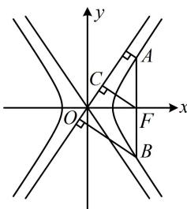

> [!faq]- 《第3节 双曲线渐近线相关问题》参考答案
>
> > [!success]- **【答案】** C
>
> > [!note]- **【分析】**
> > 本题未单列分析。
>
> > [!note]- **【解析】**
> > 解析：如图，若能注意到 $F$ 为 $AB$ 中点，则可利用梯形的中位线将已知条件转化为 $F$ 到渐近线的距离，注意到 $\triangle OFC$ 是特征三角形，所以 $|FC|$ 可快速求出，由对称性， $AB$ 中点为右焦点 $F$ ，因为 $d_{1} + d_{2} = 6$ ，所以 $F$ 到渐近线的距离为3，我们知道，双曲线焦点到渐近线的距离为 $b$ ，所以 $b = 3$ 又 $e = \frac{c}{a} = \frac{\sqrt{a^2 + b^2}}{a} = \frac{\sqrt{a^2 + 9}}{a} = 2$ ，所以 $a = \sqrt{3}$ 故双曲线 $C$ 的方程为 $\frac{x^2}{3} -\frac{y^2}{9} = 1$
> >
> > 
