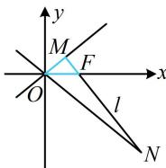

> [!faq]- 《第3节 双曲线渐近线相关问题》参考答案
>
> > [!success]- **【答案】** 详见解析
>
> > [!note]- **【分析】**
> > 本题未单列分析。
>
> > [!note]- **【解析】**
> > $\frac{2\sqrt{10}}{5}$
> >
> > 解法 1: 如图, $\triangle MOF$ 是 $C$ 的特征三角形, 先结合角平分线性质定理和 $\overrightarrow{MN} = 5\overrightarrow{MF}$ 求其它线段的长,
> >
> > 由题意， $\left|MF\right|=b$ ， $\left|OM\right|=a$ ，因为 $\overrightarrow{MN}=5\overrightarrow{MF}$ ，
> >
> > 所以 $|MN|=5b$ ， $|FN|=4b$ ，
> >
> > 由渐近线的对称性， $OF$ 是 $\angle MON$ 的平分线，
> >
> > 所以 $\frac{|OM|}{|ON|} = \frac{|MF|}{|FN|} = \frac{1}{4}$ ，故 $|ON| = 4|OM| = 4a$ ，
> >
> > 注意到 $OM \perp MN$ ，且已有 $\triangle OMN$ 的三边长，故接下来可由勾股定理建立方程求离心率，
> >
> > 在 $\triangle MON$ 中， $\left|OM\right|^2 +\left|MN\right|^2 = \left|ON\right|^2$ ，所以 $a^2 +25b^2$
> >
> > $= 16a^{2}$ ，整理得： $3a^{2} = 5b^{2}$ ，所以 $3a^{2} = 5c^{2} - 5a^{2}$
> >
> > 从而 $\frac{c^2}{a^2} = \frac{8}{5}$ ，故离心率 $e = \frac{c}{a} = \frac{2\sqrt{10}}{5}$
> >
> > 解法2：由题意， $|MF| = b$ ， $|OM| = a$
> >
> > 因为 $\overrightarrow{MN} = 5\overrightarrow{MF}$ ，所以 $|MN| = 5b$ ，
> >
> > 如图， $\angle MOF$ 和 $\angle MON$ 的正切都好求，故可由 $\angle MON$
> >
> > $=2\angle MOF$ ，利用正切二倍角公式建立方程求离心率，
> >
> > 记 $\angle MOF = \theta$ ，则 $\angle MON = 2\theta$
> >
> > 由图可知 $\tan \theta = \frac{|MF|}{|OM|} = \frac{b}{a}$ ， $\tan 2\theta = \frac{|MN|}{|OM|} = \frac{5b}{a}$
> >
> > 因为 $\tan 2\theta = \frac{2\tan\theta}{1 - \tan^2\theta}$ ，所以 $\frac{5b}{a} = \frac{2\cdot\frac{b}{a}}{1 - \frac{b^2}{a^2}}$
> >
> > 整理得： $3a^{2} = 5b^{2}$ ，所以 $3a^{2} = 5c^{2} - 5a^{2}$
> >
> > 整理得： $\frac{c^2}{a^2} = \frac{8}{5}$ ，故离心率 $e = \frac{c}{a} = \frac{2\sqrt{10}}{5}$
> >
> > 解法3：看到 $\overrightarrow{MN} = 5\overrightarrow{MF}$ ，自然想到用坐标翻译。怎样求 $M, N$ 的坐标？观察发现可先写出直线 $MN$ 的方程，与两条渐近线联立即可求出 $M, N$ 的坐标，
> >
> > 如图， $F(c,0)$ ，渐近线 $OM$ ， $ON$ 的方程分别为 $y = \frac{b}{a} x$
> >
> > $y = -\frac{b}{a} x$ ，因为 $l \perp OM$ ，所以 $l$ 的方程为 $y = -\frac{a}{b} (x - c)$
> >
> > 联立 $\left\{ \begin{array}{l} y = -\frac{a}{b} (x - c) \\ y = \frac{b}{a} x \end{array} \right.$ 解得： $y = \frac{ab}{c}$ ，即 $y_{M} = \frac{ab}{c}$ ①，
> >
> > 联立 $\left\{ \begin{array}{l} y = -\frac{a}{b} (x - c) \\ y = -\frac{b}{a} x \end{array} \right.$ 解得： $y = -\frac{abc}{a^2 - b^2}$
> >
> > 所以 $y_{N}=-\frac{abc}{a^{2}-b^{2}}$ ②,
> >
> > 因为 $\overrightarrow{MN} = 5\overrightarrow{MF}$ ，所以 $\overrightarrow{FN} = 4\overrightarrow{MF}$ ，而 $\overrightarrow{FN} = (x_N - c, y_N)$
> >
> > $\overrightarrow{MF}=(c-x_{M},-y_{M})$ ，所以 $y_{N}=-4y_{M}$ ③，
> >
> > 将①②代入③可得 $-\frac{abc}{a^2 - b^2} = -4\cdot \frac{ab}{c}$
> >
> > 整理得： $c^2 = 4a^2 -4b^2$ ，所以 $c^{2} = 4a^{2} - 4(c^{2} - a^{2})$
> >
> > 从而 $5c^{2} = 8a^{2}$ ，故 $\frac{c^2}{a^2} = \frac{8}{5}$ ，所以离心率 $e = \frac{c}{a} = \frac{2\sqrt{10}}{5}$
> >
> > 
>
> > [!tip]- **【反思】**
> > 在双曲线的渐近线有关问题中，利用渐近线与其它直线或曲线联立求交点，往往计算量较大，可作为次选方案，首选分析几何关系求解.
