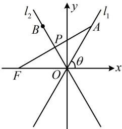

> [!faq]- 《第3节 双曲线渐近线相关问题》参考答案
>
> > [!success]- **【答案】** 2
>
> > [!note]- **【分析】**
> > 本题未单列分析。
>
> > [!note]- **【解析】**
> > 解析：如图，设 OB 与 AF 交于点 P，因为 O，B 关于直线 AF 对称，所以 $OB \perp AF$ ， $|AF| = 2b$ 这个条件怎么用？若由 $AF \perp l_{2}$ 写出直线 AF 的方程，与 $l_{1}$ 联立求 A 的坐标，再算 $|AF|$ ，则较麻烦。注意到双曲线的焦点到渐近线的距离为 b（见重要结论 18），故可翻译为 P 是 AF 的中点，我们由此出发，分析图形的几何特征，
> >
> > 因为 $OB \perp AF$ ，所以 $|FP|$ 是双曲线的左焦点到渐近线 $l_2$ 的距离，故 $|FP| = b$ ，又 $|AF| = 2b$ ，所以 $P$ 为 $AF$ 的中点，结合 $OB \perp AF$ 可得 $\triangle AOF$ 是等腰三角形，
> >
> > 且 $OB$ 也为 $\angle AOF$ 的平分线，所以 $\angle FOP = \angle AOP$
> >
> > 又由渐近线的对称性， $\angle FOP = \theta$ （其中 $\theta$ 为 $l_{1}$ 的倾斜角，如图）所以 $\angle AOP = \angle FOP = \theta = 60^{\circ}$ 从而 $l_{1}$ 的斜率 $\frac{b}{a} = \tan 60^{\circ} = \sqrt{3}$ ，故 $b = \sqrt{3} a$ 所以 $b^{2} = 3a^{2}$ ，故 $c^{2} - a^{2} = 3a^{2}$ ，化简得离心率 $e = \frac{c}{a} = 2$ ：
> >
> > 
