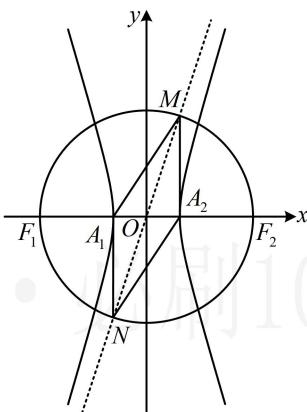

> [!faq]- 《第3节 双曲线渐近线相关问题》参考答案
>
> > [!success]- **【答案】** A
>
> > [!note]- **【分析】**
> > 本题未单列分析。
>
> > [!note]- **【解析】**
> > ## 10. (2025·全国Ⅱ卷·★★★☆) (多选)
> >
> > 双曲线 $C: \frac{x^2}{a^2} - \frac{y^2}{b^2} = 1 (a > 0, b > 0)$ 的左、右焦点分别是 $F_1$ ， $F_2$ ，左、右顶点分别为 $A_1$ ， $A_2$ ，以 $F_1F_2$ 为直径的圆与曲线 $C$ 的一条渐近线交于 $M$ ， $N$ 两点，且 $\angle NA_1M = \frac{5\pi}{6}$ ，则（）  
> > A. $\angle A_1MA_2 = \frac{\pi}{6}$ B. $|MA_1| = 2|MA_2|$ C. $C$ 的离心率为 $\sqrt{13}$ D. 当 $a = \sqrt{2}$ 时，四边形 $NA_1MA_2$ 的面积为 $8\sqrt{3}$
> >
> > 解析：A项，如图，由对称性， $A_{1}$ 与 $A_{2}$ ， $M$ 与 $N$ 都关于原点对称，所以线段 $A_{1}A_{2}$ 与线段 $MN$ 互相平分，从而四边形 $A_{1}MA_{2}N$ 是平行四边形，故 $\angle A_{1}MA_{2} = \pi - \angle NA_{1}M = \pi - \frac{5\pi}{6} = \frac{\pi}{6}$ ，故A项正确；B项，求 $\left|MA_{1}\right|$ 和 $\left|MA_{2}\right|$ 需要 $M$ 的坐标，可联立渐近线与圆的方程求解，以 $F_{1}F_{2}$ 为直径的圆的方程为 $x^{2} + y^{2} = c^{2}$ ，不妨设 $M$ ， $N$ 是渐近线 $y = \frac{b}{a} x$ 与圆的交点，将 $y = \frac{b}{a} x$ 代入 $x^{2} + y^{2} = c^{2}$ 化简得： $\frac{a^2 + b^2}{a^2} x^2 = c^2$ ，结合 $a^2 + b^2 = c^2$ 解得： $x = \pm a$ ，代入 $y = \frac{b}{a} x$ 得 $y = \pm b$ ，不妨设 $M$ 在第一象限，则 $M(a, b)$ ， $N(-a, -b)$ ，此时可发现 $M$ ， $A_{2}$ 横坐标相等，于是 $MA_{2} \perp x$ 轴，故可到 Rt△ $MA_{1}A_{2}$ 中来分析 $\left|MA_{1}\right|$ 与 $\left|MA_{2}\right|$ 的关系，在 Rt△ $MA_{1}A_{2}$ 中， $\angle A_{1}MA_{2} = \frac{\pi}{6}$ ，
> >
> > 所以 $\cos \angle A_{1}MA_{2} = \frac{|MA_{2}|}{|MA_{1}|} = \frac{\sqrt{3}}{2}$
> >
> > 从而 $\left|MA_1\right| = \frac{2\sqrt{3}}{3}\left|MA_2\right|\neq 2\left|MA_2\right|$ ，故B项错误；
> >
> > C 项，怎样建立方程求离心率？注意到 Rt△MA₁A₂ 的三边都容易用 a, b 表示，故可用勾股定理建立方程，在 Rt△MA₁A₂ 中，|A₁A₂| = 2a，|MA₂| = b， $\left|MA_{1}\right|=\frac{2\sqrt{3}}{3}\left|MA_{2}\right|=\frac{2\sqrt{3}}{3}b$ 因为 $\left|MA_{2}\right|^{2}+\left|A_{1}A_{2}\right|^{2}=\left|MA_{1}\right|^{2}$ ，所以 $b^{2}+4a^{2}=\frac{4}{3}b^{2}$ 从而 $12a^{2}=b^{2}=c^{2}-a^{2}$ ，故 $c^{2}=13a^{2}$ 所以双曲线的离心率 $e=\frac{c}{a}=\sqrt{13}$ ，故C项正确；
> > D 项，当 $a=\sqrt{2}$ 时， $b=2\sqrt{3}a=2\sqrt{6}$ ，所以 $\left|MA_{2}\right|=b$ $=2\sqrt{6}$ ， $\left|A_{1}A_{2}\right|=2a=2\sqrt{2}$ ，从而 $S_{NA_{1}MA_{2}}=2S_{\triangle MA_{1}A_{2}}$ $=2\times\frac{1}{2}\left|MA_{2}\right|\cdot\left|A_{1}A_{2}\right|=2\times\frac{1}{2}\times2\sqrt{6}\times2\sqrt{2}=8\sqrt{3}$
> >
> > 故D项正确.
> >
> > 
