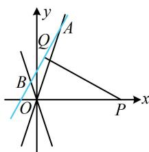

> [!faq]- 《第3节 双曲线渐近线相关问题》参考答案
>
> > [!success]- **【答案】** A
>
> > [!note]- **【分析】**
> > 本题未单列分析。
>
> > [!note]- **【解析】**
> > A
> > 解析：如何翻译 $|PA|=|PB|$ ？直接计算长度较麻烦，故设中点，用中线与底边垂直来翻译，
> > 设A，B中点为Q，则 $PQ\perp AB$ ，垂直可用斜率之积等于-1来翻译，故联立直线方程求交点A，B坐标，
> > 如图，双曲线的渐近线为 $y=\pm\frac{b}{a}x$ 联立 $\left\{\begin{aligned}y=2x+t\\ y=\frac{b}{a}x\end{aligned}\right.$ 解得： $\left\{\begin{aligned}x&=\frac{at}{b-2a}\\ y&=\frac{bt}{b-2a}\end{aligned}\right.\Rightarrow A\left(\frac{at}{b-2a},\frac{bt}{b-2a}\right)$ ,
> >
> > 联立 $\left\{ \begin{array}{l} y = 2x + t \\ y = -\frac{b}{a} x \end{array} \right.$ 解得： $\left\{ \begin{array}{l} x = -\frac{at}{b + 2a} \\ y = \frac{bt}{b + 2a} \end{array} \right. \Rightarrow B\left(-\frac{at}{b + 2a}, \frac{bt}{b + 2a}\right)$ ，
> >
> > 所以 $AB$ 中点为 $Q\left(\frac{2a^2t}{b^2 - 4a^2}, \frac{b^2t}{b^2 - 4a^2}\right)$ ,
> >
> > 因为 $\left|PA\right|=\left|PB\right|$ ，所以 $k_{PQ}\cdot k_{AB}=\frac{\frac{b^{2}t}{b^{2}-4a^{2}}-0}{\frac{2a^{2}t}{b^{2}-4a^{2}}-4t}\times2=-1$ ，
> >
> > 整理得： $b^{2} = 9a^{2}$ ，从而 $\frac{b}{a} = 3$ ，故渐近线为 $y = \pm 3x$
> >
> > 
> >
> > 一数·必刷100讲
