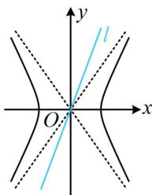
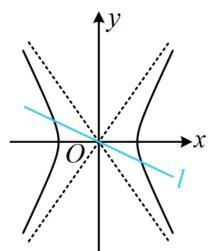
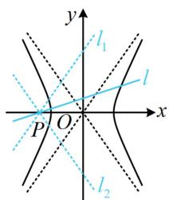
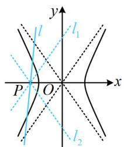
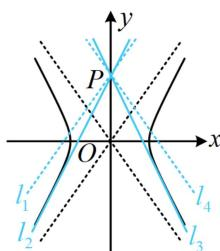
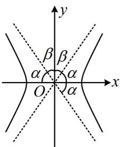
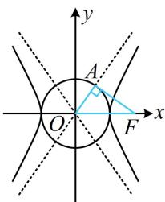
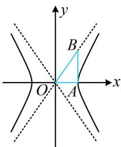

<!-- source-part:1 pages:1-10 -->

# 第 3 节 双曲线渐近线相关问题（★★★）

## 内容提要

圆锥曲线中，渐近线是双曲线独有的几何性质，相关考题较多，本节将归纳一些常见题型.

1. 借助渐近线分析直线与双曲线的交点个数:

①当直线 $l$ 过原点时，若其斜率 $k \in \left(-\infty, -\frac{b}{a}\right] \cup \left[\frac{b}{a}, +\infty\right)$ ，则直线 $l$ 与双曲线没有交点，如图1；若 $k \in \left(-\frac{b}{a}, \frac{b}{a}\right)$ ，则直线 $l$ 与双曲线有两个关于原点对称的交点，如图2.

②当直线过双曲线内部定点 $P$ 时, 若其斜率 $k = \pm \frac{b}{a}$ , 即直线与渐近线平行, 则直线与双曲线有 1 个交点, 如图 3 中的 $l_{1}$ 和 $l_{2}$ ; 若 $k \in \left(-\frac{b}{a}, \frac{b}{a}\right)$ , 则直线与双曲线的两支各有 1 个交点, 如图 3 中的 $l$ ; 若 $k \in \left(-\infty, -\frac{b}{a}\right) \cup \left(\frac{b}{a}, +\infty\right)$ , 则直线与双曲线的同支有 2 个交点, 如图 4 中的 $l$ .

③当直线过双曲线外部定点 $P$ （不与原点重合）时，分析交点个数还需借助切线，如图5， $l_{1}$ 和 $l_{4}$ 是与渐近线平行的直线， $l_{2}$ 和 $l_{3}$ 是双曲线的两条切线，我们让直线 $l$ 从 $l_{1}$ 出发绕点 $P$ 逆时针旋转，恰好为 $l_{1}$ 时，与双曲线有1个交点；转到 $l_{1}$ 和 $l_{2}$ 之间时，与双曲线在同支有2个交点；恰好为 $l_{2}$ 时，与双曲线有1个交点；在 $l_{2}$ 和 $l_{3}$ 之间时，没有交点；恰好为 $l_{3}$ 时，有1个交点；在 $l_{3}$ 和 $l_{4}$ 之间时，与双曲线在同支有2个交点；恰好为 $l_{4}$ 时，有1个交点；从 $l_{4}$ 继续转回 $l_{1}$ 的过程中，与双曲线在两支上各有1个交点.

  
图1

  
图2

  
图3

  
图4

  
图5

2. 渐近线的角度关系: 如图 6, 双曲线的两条渐近线关于 $x$ 轴、 $y$ 轴对称, 所以图 6 中左右两个角相等, 设为 $\alpha$ , 中间两个角也相等, 设为 $\beta$ , 且 $\alpha + \beta = 90^{\circ}$ .

3. 双曲线的两类特征三角形:

①如图7，设 $F$ 为双曲线 $\frac{x^2}{a^2} -\frac{y^2}{b^2} = 1(a > 0,b > 0)$ 的右焦点，过 $F$ 作一条渐近线的垂线，垂足为 $A$ ，则在 $\triangle AOF$ 中， $\vert AF\vert = b$ ， $\vert OA\vert = a$ ， $\vert OF\vert = c$ ，这个三角形有双曲线的全部特征参数，所以把$\triangle AOF$ 称为双曲线的“特征三角形”. 由对称性, 这样的特征三角形有 4 个. 由于点 $A$ 满足 $\left|OA\right| = a$ , 所以 $A$ 在圆 $x^{2} + y^{2} = a^{2}$ 上, 由 $OA \perp AF$ 可得 $AF$ 是该圆的切线, 若要求点 $A$ 的坐标, 可联立 $\left\{ \begin{array}{l} y = \frac{b}{a} x \\ x^{2} + y^{2} = a^{2} \end{array} \right.$ 求得 $\left\{ \begin{array}{l} x^{2} = \frac{a^{4}}{c^{2}} \\ y^{2} = \frac{a^{2}b^{2}}{c^{2}} \end{array} \right.$ , 所以图 7 中点 $A$ 的坐标为 $\left(\frac{a^{2}}{c}, \frac{ab}{c}\right)$ .

②如图8， $A$ 为双曲线的右顶点，过 $A$ 作 $x$ 轴的垂线交一条渐近线于点 $B$ ，则在 $\triangle AOB$ 中， $|OA| = a$ ， $|AB| = b$ ， $|OB| = c$ ，这个三角形也有双曲线的全部特征，所以把 $\triangle AOB$ 称为双曲线的“特征三角形”，由对称性，这样的特征三角形有4个.

  
图6

  
图7

  
图8

![[高中/总复习/教辅/一数常规版2026/第10章 解析几何/模块4 双曲线与方程/第3节 双曲线渐近线相关问题/类型01_借助渐近线进行图形分析/类型01_借助渐近线进行图形分析.md]]
![[高中/总复习/教辅/一数常规版2026/第10章 解析几何/模块4 双曲线与方程/第3节 双曲线渐近线相关问题/类型02_渐近线相关的综合运算/类型02_渐近线相关的综合运算.md]]
![[高中/总复习/教辅/一数常规版2026/第10章 解析几何/模块4 双曲线与方程/第3节 双曲线渐近线相关问题/强化训练/强化训练.md]]
