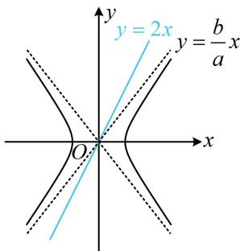

> [!faq]- 《第3节 双曲线渐近线相关问题》例题解析
>
> > [!success]- **【答案】** 2（答案不唯一，满足 $1 < e \leq \sqrt{5}$ 的 $e$ 值均可）
>
> > [!note]- **【分析】**
> > 本题未单列分析。
>
> > [!note]- **【解析】**
> > 解析：过原点的直线与双曲线没有交点的临界状态是渐近线，故可画图，比较斜率，
> > 如图，直线 y=2x 与 C 无公共点 $\Leftrightarrow \frac{b}{a} \leq 2 \Leftrightarrow b \leq 2a \Leftrightarrow b^{2} \leq 4a^{2}$ $\Leftrightarrow c^{2}-a^{2}\leq4a^{2}\Leftrightarrow\frac{c^{2}}{a^{2}}\leq5$ ，结合 e>1 可得 $1<e=\frac{c}{a}\leq\sqrt{5}$ .
> >
> >
> > 
