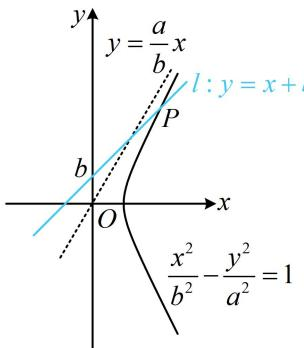

> [!faq]- 《第3节 双曲线渐近线相关问题》例题解析
>
> > [!success]- **【答案】** A
>
> > [!note]- **【分析】**
> > 本题未单列分析。
>
> > [!note]- **【解析】**
> > 解析：看到 $\left|PF_{1}\right|-\left|PF_{2}\right|=2b$ ，联想到点P在某双曲线（不是双曲线C）上，该双曲线的焦点也是 $F_{1}$ ， $F_{2}$ ，但距离之差是定值2b，相当于和原双曲线C相比，c不变，把a和b交换即可，
> >
> > 由题意，满足 $\left|PF_{1}\right|-\left|PF_{2}\right|=2b$ 的点P在双曲线 $\frac{x^{2}}{b^{2}}-\frac{y^{2}}{a^{2}}=1$ 的右支上，所以直线l与该双曲线右支有交点，涉及直线与双曲线的交点问题，可借助渐近线来分析，
> >
> > 如图，则直线 $l$ 的斜率是1，双曲线 $\frac{x^2}{b^2} -\frac{y^2}{a^2} = 1$ 渐近线是 $y = \pm \frac{a}{b} x$ 由图可知要使 $l$ 与该双曲线右支有交点，只需 $1 <   \frac{a}{b}$ ，所以 $a > b$ 从而 $a^2 >b^2 = c^2 -a^2$ ，故 $\frac{c^2}{a^2} <  2$ ，所以 $e <   \sqrt{2}$ ，又 $e > 1$ ，所以 $1 <   e <   \sqrt{2}$
> >
> >
> > 
>
> > [!tip]- **【反思】**
> > 从上面两道题可以看出，涉及直线与双曲线的交点个数问题，常借助渐近线来分析临界状态.
