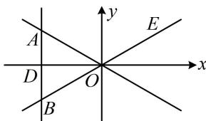

> [!faq]- 《第3节 双曲线渐近线相关问题》例题解析
>
> > [!success]- **【答案】** A
>
> > [!note]- **【分析】**
> > 本题未单列分析。
>
> > [!note]- **【解析】**
> > A. 2 B. $\frac{3}{2}$ C. $\sqrt{3}$ D. $\frac{2\sqrt{3}}{3}$
> >
> > 解析：如图，由所给向量的夹角可求得渐近线的倾斜角，进而求出斜率，
> >
> > 由题意， $\angle AOB = 60^{\circ}$ ，设直线 $AB$ 与 $x$ 轴交于点 $D$ ， $E$ 为渐近线上第一象限的一点，则 $\angle BOD = 30^{\circ}$ ，所以 $\angle EOx = \angle BOD = 30^{\circ}$ ，故渐近线 $BE$ 的倾斜角为 $30^{\circ}$ ，
> >
> > 其斜率 $\frac{a}{b} = \tan 30^{\circ} = \frac{\sqrt{3}}{3}$ ，所以 $b = \sqrt{3} a$ ，从而 $b^{2} = c^{2} - a^{2} = 3a^{2}$ ，整理得： $\frac{c^2}{a^2} = 4$ ，故离心率 $e = \frac{c}{a} = 2$ 。
> >
> > 
