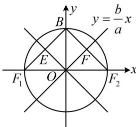

> [!faq]- 《第3节 双曲线渐近线相关问题》例题解析
>
> > [!success]- **【答案】** $\sqrt{2}$
>
> > [!note]- **【分析】**
> > 本题未单列分析。
>
> > [!note]- **【解析】**
> > 解析：如图，图形比较规则，要求离心率，可尝试先从几何关系分析渐近线的夹角，
> >
> > 由题意，四边形OFBE为平行四边形，又 $F_{1}F_{2}$ 是圆的直径，所以 $BF_{1}\bot BF_{2}$ ，从而四边形OFBE为矩形，
> >
> > 故 $\angle EOF = 90^{\circ}$ ，结合两条渐近线关于 $y$ 轴对称知 $\angle FOB = 45^{\circ}$ 所以 $\angle FOF_{2} = 45^{\circ}$ ，从而渐近线 $OF$ 的斜率 $\frac{b}{a} = \tan 45^{\circ} = 1$ ，故 $a = b$ 所以 $a^2 = b^2 = c^2 - a^2$ ，整理得： $\frac{c^2}{a^2} = 2$ ，故 $e = \frac{c}{a} = \sqrt{2}$
> >
> > 
>
> > [!tip]- **【反思】**
> > - **①**：双曲线的两条渐近线分别关于 $x$ 轴、 $y$ 轴对称，由此可得到一些特殊的角度相等关系，这也是渐近线最基础的几何性质；
> > - **②**：两渐近线夹角为 $90^{\circ}$ 的双曲线是等轴双曲线，其离心率为 $\sqrt{2}$ .
