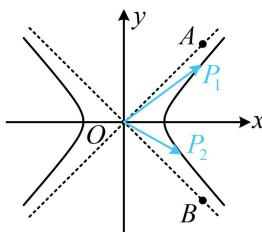

> [!faq]- 《第3节 双曲线渐近线相关问题》例题解析
>
> > [!success]- **【答案】** $[1, +\infty)$
>
> > [!note]- **【分析】**
> > 本题未单列分析。
>
> > [!note]- **【解析】**
> > 解析：看到 $x_{1}x_{2} + y_{1}y_{2}$ ，想到向量的数量积，由题意， $\overrightarrow{OP_1} = (x_1,y_1)$ ， $\overrightarrow{OP_2} = (x_2,y_2)$ 且 $\overrightarrow{OP_1}\cdot \overrightarrow{OP_2} = x_1x_2 + y_1y_2 > 0$ ，所以 $\angle P_{1}OP_{2}$ 为锐角，如图，只需 $\angle AOB\leq 90^{\circ}$ 即可，所以 $\angle AOx\leq 45^{\circ}$ 故渐近线 $OA$ 的斜率 $\frac{1}{a}\leq \tan 45^{\circ} = 1$ ，结合 $a > 0$ 可得 $a\geq 1$
> >
> > 
>
> > [!tip]- **【反思】**
> > 可以发现，本题我们又用到了通过判断数量积的正负来分析角度的锐钝这一方法.
