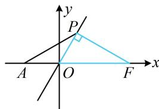

> [!faq]- 《第3节 双曲线渐近线相关问题》例题解析
>
> > [!success]- **【答案】** 2
>
> > [!note]- **【分析】**
> > 本题未单列分析。
>
> > [!note]- **【解析】**
> > 解析：条件涉及渐近线，先考虑通过几何关系分析渐近线的倾斜角，
> >
> > 如图，渐近线为 $y = \frac{b}{a} x$ ，即 $bx - ay = 0$ ，右焦点 $F(c,0)$ 到渐近线的距离 $|PF| = \frac{|bc|}{\sqrt{b^2 + (-a)^2}} = \frac{|bc|}{c} = b$ ，
> >
> > 又 $\left|OF\right|=c$ ，所以 $\left|OP\right|=\sqrt{\left|OF\right|^{2}-\left|PF\right|^{2}}=\sqrt{c^{2}-b^{2}}=a$ ，因为 $\left|OA\right|=a$ ，所以 $\left|OP\right|=\left|OA\right|$
> >
> > 从而 $\angle APO = \angle PAO = 30^{\circ}$ ，故 $\angle POF = \angle PAO + \angle APO = 60^{\circ}$
> >
> > 有了渐近线的倾斜角，可求其斜率，再转换成离心率即可，
> > 所以渐近线 OP 的斜率 $\frac{b}{a} = \tan 60^{\circ} = \sqrt{3}$ ，从而 $b = \sqrt{3}a$ ，故 $b^{2} = c^{2} - a^{2} = 3a^{2}$ ，整理得： $\frac{c^{2}}{a^{2}} = 4$ ，所以 C 的离心率 $e = \frac{c}{a} = 2$ 。
> >
> > 
>
> > [!tip]- **【反思】**
> > 上图中的 $\triangle POF$ 的三边长分别为 $a, b, c$ ，我们把它叫做双曲线的一个“特征三角形”，在后续的某些题目中，熟悉这一结论，可以迅速发现图形中的一些几何关系.
