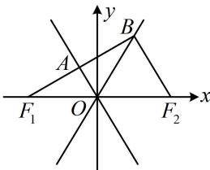

> [!faq]- 《第3节 双曲线渐近线相关问题》例题解析
>
> > [!success]- **【答案】** 2
>
> > [!note]- **【分析】**
> > 本题未单列分析。
>
> > [!note]- **【解析】**
> > 解法1：条件中有向量的数量积，可考虑设坐标来算，如图，点 $B$ 在渐近线 $y = \frac{b}{a} x$ 上，可设 $B\left(x_0, \frac{b}{a} x_0\right)$ ， $F_1(-c, 0)$ ， $F_2(c, 0)$ ，则 $\overrightarrow{F_1B} = \left(x_0 + c, \frac{b}{a} x_0\right)$ ， $\overrightarrow{F_2B} = \left(x_0 - c, \frac{b}{a} x_0\right)$ ，
> >
> > 所以 $\overrightarrow{F_1B} \cdot \overrightarrow{F_2B} = (x_0 + c)(x_0 - c) + \frac{b^2}{a^2} x_0^2 = \left(1 + \frac{b^2}{a^2}\right)x_0^2 - c^2 = \frac{c^2}{a^2} x_0^2 - c^2 = 0$ ，解得： $x_0 = a$ 或 $-a$ （舍去），故 $B(a, b)$ ，求得了 $B$ ，可由 $\overrightarrow{F_1A} = \overrightarrow{AB}$ 求 $A$ 的坐标，代入另一渐近线 $y = -\frac{b}{a} x$ 即可建立方程求离心率，由 $\overrightarrow{F_1A} = \overrightarrow{AB}$ 知 $A$ 为 $F_1B$ 中点，所以 $A\left(\frac{a - c}{2}, \frac{b}{2}\right)$ ，代入 $y = -\frac{b}{a} x$ 得： $\frac{b}{2} = -\frac{b}{a} \cdot \frac{a - c}{2}$ ，整理得离心率 $e = \frac{c}{a} = 2$ 。解法2：所给的数量积恰好为0，可翻译为垂直，于是也可尝试分析几何特征，找渐近线的倾斜角，如图，由 $\overrightarrow{F_1B} \cdot \overrightarrow{F_2B} = 0$ 知 $BF_1 \perp BF_2$ ，又 $O$ 为 $F_1F_2$ 中点，所以 $|OB| = \frac{1}{2}|F_1F_2| = |OF_1|$ ，由 $\overrightarrow{F_1A} = \overrightarrow{AB}$ 知 $A$ 为 $F_1B$ 中点，故 $\angle AOB = \angle AOF_1$ （原因：等腰三角形底边中线也是顶角的平分线）
> >
> > 又由渐近线的对称性， $\angle AOF_{1} = \angle BOF_{2}$ ，所以 $\angle AOB = \angle AOF_{1} = \angle BOF_{2} = 60^{\circ}$ 从而渐近线 $OB$ 的斜率 $\frac{b}{a} = \tan \angle BOF_2 = \tan 60^\circ = \sqrt{3}$ ，故 $b = \sqrt{3} a$ 所以 $b^{2} = 3a^{2}$ ，从而 $c^2 -a^2 = 3a^2$ ，故 $e = \frac{c}{a} = 2$
> >
> > 
