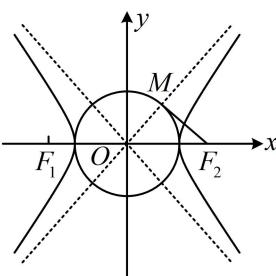
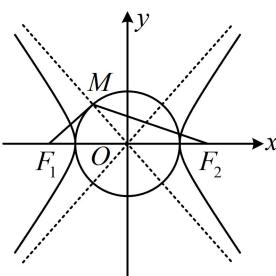

> [!faq]- 《第3节 双曲线渐近线相关问题》例题解析
>
> > [!success]- **【答案】** B
>
> > [!note]- **【分析】**
> > 本题未单列分析。
>
> > [!note]- **【解析】**
> > 解析：由对称性，不妨设 $M$ 在 $x$ 轴上方，有如图1和图2所示的两种情况，应先判断是哪种，若为图1，则 $\triangle MOF_{2}$ 是双曲线的一个特征三角形，所以 $\left|MF_{2}\right| = b < \frac{\sqrt{2}}{2}\left|F_{1}F_{2}\right| = \sqrt{2} c$ ，不合题意；若为图2，则 $\triangle MOF_{1}$ 是双曲线的一个特征三角形，
> >
> > $$
> > \angle M O F _ {1}
> > $$
> >
> > $$
> > \angle M O F _ {2}
> > $$
> >
> > 在 $\triangle MOF_{1}$ 中， $|OM| = a$ ， $|OF_{1}| = c$ ，且 $OM \perp MF_{1}$ ，所以 $\cos \angle MOF_{1} = \frac{a}{c}$ ，
> >
> > 在 $\triangle MOF_{2}$ 中， $|MF_{2}| = \frac{\sqrt{2}}{2} |F_{1}F_{2}| = \sqrt{2} c$ ， $|OF_{2}| = c$ ，所以 $\cos \angle MOF_{2} = \frac{|OM|^{2} + |OF_{2}|^{2} - |MF_{2}|^{2}}{2|OM| \cdot |OF_{2}|} = \frac{a^{2} - c^{2}}{2ac}$ ，由图可知 $\angle MOF_{1} = \pi - \angle MOF_{2}$ ，所以 $\cos \angle MOF_{1} = \cos (\pi - \angle MOF_{2}) = -\cos \angle MOF_{2}$ ，故 $\frac{a}{c} = -\frac{a^2 - c^2}{2ac}$ ，整理得离心率 $e = \frac{c}{a} = \sqrt{3}$ .
> >
> > 
> >
> >   
> > 图1  
> > 图2
