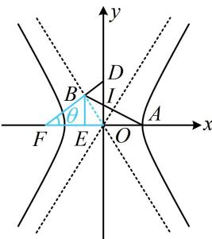

> [!faq]- 《第3节 双曲线渐近线相关问题》例题解析
>
> > [!success]- **【答案】** C
>
> > [!note]- **【分析】**
> > 本题未单列分析。
>
> > [!note]- **【解析】**
> > 解析：如图，直线 $AB$ 过 $OD$ 中点 $I$ 怎样翻译？可翻译成 $k_{AI} = k_{AB}$ ，故需要 $I, B$ 的坐标。观察发现 $\triangle FBO$ 是双曲线的一个特征三角形，容易通过几何关系求得点 $B$ 和 $D$ 的坐标， $I$ 的坐标也就有了，由题意， $|FB| = b$ ， $|OB| = a$ ， $|OF| = c$ ，设 $\angle BFO = \theta$ ，则 $\angle BOE = 90^\circ - \theta$ ，作 $BE \perp x$ 轴于点 $E$ ， $|BE| = |FB|\sin \theta = |FB| \cdot \frac{|OB|}{|OF|} = \frac{ab}{c}$ ， $|OE| = |OB|\cos \angle BOE = a\cos (90^\circ - \theta) = a\sin \theta = a \cdot \frac{|OB|}{|OF|} = \frac{a^2}{c}$ ，所以 $B\left(-\frac{a^2}{c}, \frac{ab}{c}\right)$ ，又 $|OD| = |OF|\tan \theta = |OF| \cdot \frac{|OB|}{|FB|} = \frac{ac}{b}$ ，所以 $D\left(0, \frac{ac}{b}\right)$ ，故 $OD$ 中点为 $I\left(0, \frac{ac}{2b}\right)$ ，
> >
> > 接下来按 $k_{AI} = k_{AB}$ 翻译直线 $AB$ 过点 $I$ , 从而建立方程求离心率,接下来按 $k_{AI} = k_{AB}$ 翻译直线 $AB$ 过点 $I$ ，从而建立方程求离心率，由题意， $A(a,0)$ ，且 $A,I,B$ 三点共线，所以 $k_{AI} = k_{AB}$ 故 $\frac{ac}{2b} -0 = \frac{ab}{c} -0$ 整 $\frac{a c}{0 - a} = \frac{c}{-a^2 - a}$ 整理得： $ac + c^2 = 2b^2$ 所以 $ac + c^2 = 2c^2 -2a^2$ ，故 $c^2 -ac - 2a^2 = 0$ 两端同除以 $a^2$ 可得 $e^2 -e - 2 = 0$ ，解得： $e = 2$ 或-1（舍去）.
> >
> > 
>
> > [!tip]- **【总结】**
> > 由例 3 及其变式可发现，渐近线问题中对于几何条件的翻译和做法，与前面小节大同小异.
