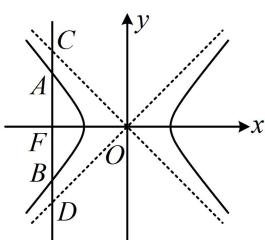

> [!faq]- 《第3节 双曲线渐近线相关问题》例题解析
>
> > [!success]- **【答案】** $\sqrt{2}$
>
> > [!note]- **【分析】**
> > 本题未单列分析。
>
> > [!note]- **【解析】**
> > 解析：翻译 $|CD| = \sqrt{2}|AB|$ 需要 $|AB|$ 和 $|CD|$ ，求 $|AB|$ 可用通径公式，而 $|CD|$ 可通过求 C，D 的坐标来算，由通径公式， $|AB| = \frac{2b^{2}}{a}$ ，由题意，直线 l 的方程为 x = -c，代入 $y = -\frac{b}{a}x$ 解得： $y = \frac{bc}{a}$ ，
> >
> > 如图， $y_{C} = \frac{bc}{a}$ ，由对称性可知， $y_{D} = -\frac{bc}{a}$ ，所以 $|CD| = \frac{2bc}{a}$ ，因为 $|CD| = \sqrt{2}|AB|$ ，所以 $\frac{2bc}{a} = \sqrt{2}\cdot \frac{2b^2}{a}$ ，从而 $c = \sqrt{2} b$ ，故 $c^2 = 2b^2 = 2c^2 - 2a^2$ ，整理得： $\frac{c^2}{a^2} = 2$ ，所以双曲线的离心率 $e = \frac{c}{a} = \sqrt{2}$ 。
> >
> > 
