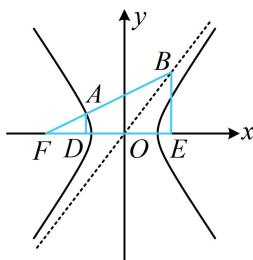

> [!faq]- 《第3节 双曲线渐近线相关问题》例题解析
>
> > [!success]- **【答案】** 详见解析
>
> > [!note]- **【分析】**
> > 本题未单列分析。
>
> > [!note]- **【解析】**
> > 解析：如图，点 $B$ 的坐标可通过联立直线 $AB$ 和渐近线的方程来求，先求该坐标，由题意， $F(-c,0)$ ，直线 AB 的方程为 $y=\frac{b}{4a}(x+c)$ ，联立 $\left\{\begin{aligned}y&=\frac{b}{4a}(x+c)\\ y&=\frac{b}{a}x\end{aligned}\right.$ 解得： $\left\{\begin{aligned}x&=\frac{c}{3}\\ y&=\frac{bc}{3a}\end{aligned}\right.$ ，所以 $B\left(\frac{c}{3},\frac{bc}{3a}\right)$ ，
> > 题干给出 $|FB|=3|FA|$ ，可由此构造相似三角形求得 A 的坐标，代入双曲线即可建立方程求离心率，
> > 作 $AD \perp x$ 轴于 D， $BE \perp x$ 轴于 E，则 $\triangle FAD \sim \triangle FBE$ ，且 $E\left(\frac{c}{3},0\right)$ ， $|EF|=\frac{4c}{3}$ ， $|BE|=\frac{bc}{3a}$ ，
> >
> > 因为 $|FB|=3|FA|$ ，所以 $\frac{|FD|}{|EF|}=\frac{|AD|}{|BE|}=\frac{1}{3}$ ，故 $|FD|=\frac{1}{3}|EF|=\frac{4c}{9}$
> >
> > $\left|OD\right| = \left|OF\right| - \left|FD\right| = \frac{5c}{9},\quad \left|AD\right| = \frac{1}{3}\left|BE\right| = \frac{bc}{9a}$ 所以 $A\left(-\frac{5c}{9},\frac{bc}{9a}\right)$
> >
> > 代入 $\frac{x^2}{a^2} -\frac{y^2}{b^2} = 1$ 得 $\frac{25c^2}{81a^2} -\frac{b^2c^2}{81a^2b^2} = 1$ ，整理得： $\frac{c^2}{a^2} = \frac{27}{8}$ ，故离心率 $e = \frac{c}{a} = \frac{3\sqrt{6}}{4}$
> >
> > 
> >
> > $$
> > \frac {3 \sqrt {6}}{4}
> > $$
>
> > [!tip]- **【总结】**
> > 从上面两道题可以看出，渐近线有关问题，若不便从几何角度分析，也可用其方程参与运算，按代数的方法来求解问题，但这样做计算量往往更大一些，为次选方案.
