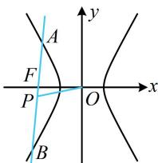

> [!faq]- 《第4节 高考中双曲线常用的二级结论》参考答案
>
> > [!success]- **【答案】** A
>
> > [!note]- **【分析】**
> > 本题未单列分析。
>
> > [!note]- **【解析】**
> > A
> >
> > 解析：涉及弦中点，考虑用中点弦斜率积结论，如图， $k_{AB}\cdot k_{OP} = \frac{b^2}{4}$ ，所以 $2\times \frac{1}{4} = \frac{b^2}{4}$ ，解得： $b^{2} = 2$ 故双曲线的离心率 $e = \frac{c}{a} = \frac{\sqrt{4 + b^2}}{2} = \frac{\sqrt{6}}{2}$
> >
> > 
