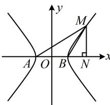

> [!faq]- 《第4节 高考中双曲线常用的二级结论》参考答案
>
> > [!success]- **【答案】** B
>
> > [!note]- **【分析】**
> > 本题未单列分析。
>
> > [!note]- **【解析】**
> > (★★★)
> >
> > 已知 $A$ ， $B$ 为双曲线 $E$ 的左、右顶点，点 $M$ 在 $E$ 上， $\triangle ABM$ 为等腰三角形，且顶角为 $120^{\circ}$ ，则 $E$ 的离心率为（）A. $\sqrt{5}$ B.2 C. $\sqrt{3}$ D. $\sqrt{2}$
> >
> > 解法1：如图，观察发现可由所给的关于 $\triangle ABM$ 的条件分析几何特征，求得 $M$ 的坐标，代入双曲线方程求离心率，设双曲线 $E: \frac{x^2}{a^2} - \frac{y^2}{b^2} = 1 (a > 0, b > 0)$ ，不妨设 $M$ 在第一象限，过 $M$ 作 $MN \perp x$ 轴于 $N$ ，由题意， $\angle ABM = 120^\circ$ ， $|AB| = |BM| = 2a$ ，所以 $\angle MBN = 180^\circ - \angle ABM = 60^\circ$ ， $|BN| = |BM| \cdot \cos \angle MBN = 2a \cos 60^\circ = a$ ， $|ON| = |OB| + |BN| = 2a$ ， $|MN| = |BM| \cdot \sin \angle MBN = 2a \sin 60^\circ = \sqrt{3}a$ ，故 $M(2a, \sqrt{3}a)$ ，代入双曲线方程得： $\frac{(2a)^2}{a^2} - \frac{(\sqrt{3}a)^2}{b^2} = 1$ ，
> >
> > 所以 $a^2 = b^2 = c^2 - a^2$ ，从而 $\frac{c^2}{a^2} = 2$
> >
> > 故 $E$ 的离心率 $e = \frac{c}{a} = \sqrt{2}$
> >
> > 解法2： $A$ ， $B$ 为两个顶点， $M$ 在双曲线 $E$ 上，符合第三定义斜率积结论的场景，故也考虑可由用结论来速求离心率，设双曲线 $E:\frac{x^2}{a^2} -\frac{y^2}{b^2} = 1(a > 0,b > 0)$
> >
> > 由题意， $\angle ABM = 120^{\circ}$ ， $\angle BAM = \angle BMA = 30^{\circ}$
> >
> > $$
> > \angle M B x = 1 8 0 ^ {\circ} - \angle A B M = 6 0 ^ {\circ}
> > $$
> >
> > 所以 $k_{MA} = \tan \angle BAM = \frac{\sqrt{3}}{3}, k_{MB} = \tan \angle MBx = \sqrt{3}$
> >
> > 由第三定义斜率积结论， $k_{MA}\cdot k_{MB} = \frac{\sqrt{3}}{3}\times \sqrt{3} = \frac{b^2}{a^2}$
> >
> > 所以 $a^2 = b^2 = c^2 - a^2$ ，从而 $\frac{c^2}{a^2} = 2$ ，故 $e = \frac{c}{a} = \sqrt{2}$ 。
> >
> > 
